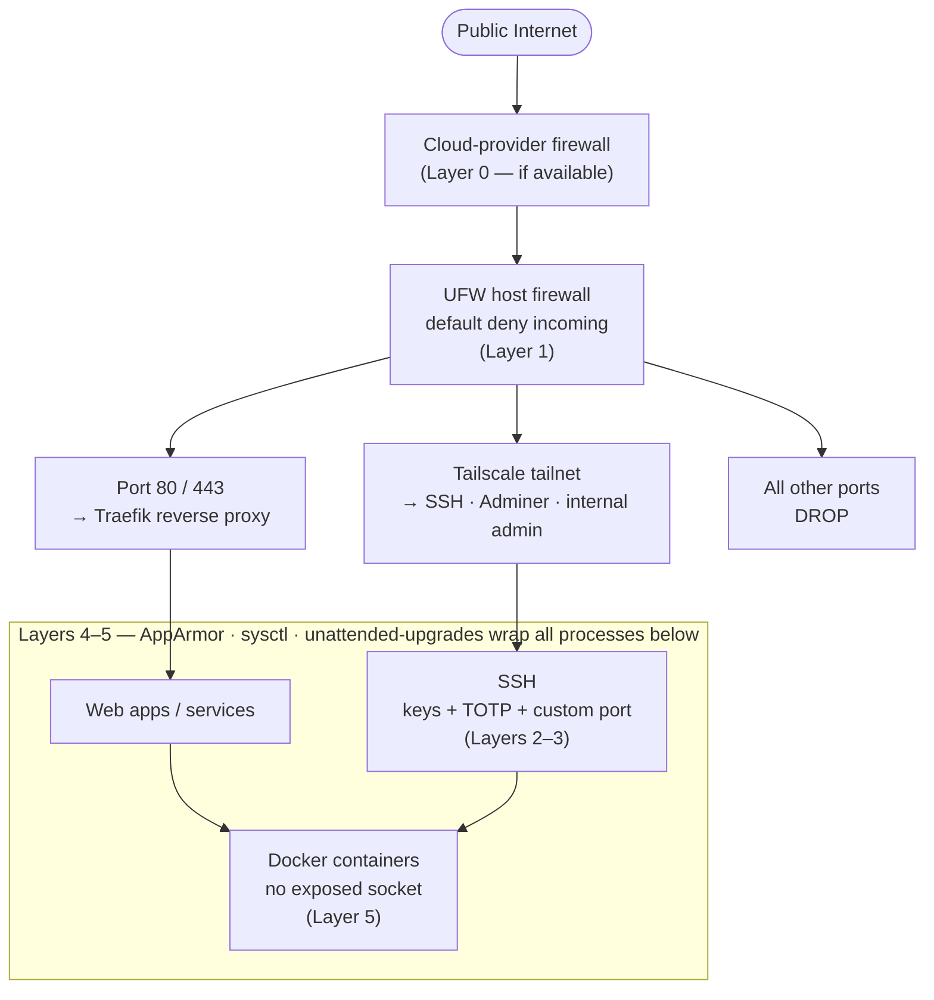

# VPS Hardening Playbook

> A reference + executable playbook for hardening a Debian/Ubuntu VPS aimed at small-team or personal use. Each control is structured **What → Why → How → Verify** so it's equally usable as a reading reference and as an LLM-driven runbook.

**Tested on:** Ubuntu 24.04 LTS on Contabo. Mostly portable to Debian 12+, Ubuntu 22.04+, and any cloud provider (Hetzner, DigitalOcean, AWS Lightsail, etc.). Where commands diverge for non-Debian distros, it's noted inline.

**Out of scope:** enterprise compliance regimes (CIS Level 2, STIG, PCI-DSS), HIDS at scale (Wazuh, OSSEC), centralised log shipping (ELK/Loki), and rootless container migrations. Those are useful at larger scale; this playbook is calibrated for "a few VPS instances I personally administer."

---

## Table of contents

0. [Scope, audience, threat model](#0-scope-audience-threat-model)
1. [Pre-flight — read before touching anything](#1-pre-flight--read-before-touching-anything)
2. [The layered-defence model](#2-the-layered-defence-model)
3. [Phase 1 — Foundation](#3-phase-1--foundation)
4. [Phase 2 — Network perimeter](#4-phase-2--network-perimeter)
5. [Phase 3 — SSH hardening](#5-phase-3--ssh-hardening)
6. [Phase 4 — Two-factor authentication (TOTP)](#6-phase-4--two-factor-authentication-totp)
7. [Phase 5 — Lock down access](#7-phase-5--lock-down-access)
8. [Phase 6 — OS / kernel hardening](#8-phase-6--os--kernel-hardening)
9. [Phase 7 — Intrusion detection & monitoring](#9-phase-7--intrusion-detection--monitoring)
10. [Phase 8 — Container hardening (Docker)](#10-phase-8--container-hardening-docker)
11. [Post-hardening verification checklist](#11-post-hardening-verification-checklist)
12. [Recovery: what to do if you lock yourself out](#12-recovery-what-to-do-if-you-lock-yourself-out)
13. [References](#13-references)

---

## 0. Scope, audience, threat model

### Audience

You: solo dev / small-team running 1–10 VPS instances for personal projects, side-business infra, hobby services. You SSH from a known set of devices, ideally over a private overlay network (Tailscale / WireGuard / ZeroTier).

### Threat model — what we're defending against

| Threat | Likelihood | This playbook's answer |
|---|---|---|
| Drive-by SSH brute-force from random IPs | **Very high** (constant on any public IP) | Tailscale + UFW interface-scoping makes sshd invisible publicly; key-only auth + TOTP makes it unbreakable even if exposed |
| Public-facing service vulns (n8n, web app, etc.) being exploited | High | TLS via Traefik, narrow firewall, AppArmor, regular patching |
| Account compromise via leaked SSH key | Medium | TOTP second factor; key passphrase |
| Supply-chain compromise of a dependency / package | Medium | unattended-upgrades, debsums, AppArmor confinement |
| Insider misuse (rare for solo) | Low | use_pty in sudoers, audit logs |
| Physical access / cloud-provider compromise | Low | Out of scope — full-disk-encryption helps but most VPS don't expose it |

### What "good enough" looks like

Five layers of defence such that **any single failure is recoverable**:

1. Network reachability (Tailscale + cloud-provider FW)
2. Host firewall (UFW)
3. SSH access (keys + TOTP + custom port + AllowUsers)
4. OS hardening (sysctl, AppArmor, patching)
5. Application/container isolation (AppArmor profiles, no exposed Docker socket)

If you've done all five, an attacker needs to compromise multiple independent layers to get in.

---

## 1. Pre-flight — read before touching anything

**Before you change SSH or firewall settings, ensure you have a recovery path.** A locked-out VPS is salvageable, but it's stressful.

### Recovery checklist

- [ ] You can reach the **cloud-provider web console** (Contabo VPS Control, AWS Console, Hetzner Robot, etc.) and have logged in once recently.
- [ ] You know the password for that console account.
- [ ] You know the **root password** OR have console-mounted recovery (Contabo: Web Console; AWS: SSM Session Manager / EC2 Instance Connect).
- [ ] You have **at least two open SSH sessions** when changing sshd config — one to apply changes, one as a safety net. The custom-port step (§5.3) requires a third to test the new port while keeping both existing sessions open.
- [ ] You've run `sudo sshd -t` to validate config syntax **before** restarting sshd.
- [ ] Backup `/etc/ssh/`, `/etc/sudoers`, `/etc/sudoers.d/`, and `/etc/pam.d/sshd`:
  ```
  sudo cp -a /etc/ssh /root/etc-ssh.bak.$(date +%F)
  sudo cp -a /etc/sudoers /etc/sudoers.d /root/sudoers.bak.$(date +%F)
  sudo cp -a /etc/pam.d/sshd /root/sshd-pam.bak.$(date +%F)
  ```

### Things that have locked people out

1. Restarting sshd with `Match` blocks in a broken state (config valid syntactically, but Match excludes you).
2. UFW reset on a remote box without re-allowing SSH.
3. Setting `AllowUsers someuser` and that user not existing or not having keys.
4. Binding sshd to `ListenAddress 100.x.x.x` (Tailscale) before Tailscale is actually up.
5. Locking root password before confirming sudo works for the unprivileged user.

The phase sequence below is designed specifically to avoid all of these.

---

## 2. The layered-defence model



The principle: **no single misconfiguration should expose the whole box.**

---

## 3. Phase 1 — Foundation

*Do this first. You're still logged in as root from the cloud-provider console or initial SSH on port 22.*

### 3.1 Create a non-root sudo user

**What:** An unprivileged user account that escalates to root via sudo when needed.

**Why it protects:** Forces an extra authentication step for privileged actions. Attackers know "root" is a valid username on every Linux box — a named user is one more layer to defeat. Cleaner audit trail too.

**How (as root):**
```bash
adduser glenbenatiro
usermod -aG sudo glenbenatiro
mkdir -p /home/glenbenatiro/.ssh
cp ~/.ssh/authorized_keys /home/glenbenatiro/.ssh/
chown -R glenbenatiro:glenbenatiro /home/glenbenatiro/.ssh
chmod 700 /home/glenbenatiro/.ssh
chmod 600 /home/glenbenatiro/.ssh/authorized_keys
```

**Verify:**
```bash
# From a second terminal, test login as the new user before continuing:
ssh glenbenatiro@vps
sudo -v     # confirm sudo works
```

**Don't close your root session** until you confirm the new user can log in and sudo.

### 3.2 No empty passwords

**What:** Ensure no account has an empty password field in `/etc/shadow`.

**Why it protects:** An empty password = passwordless login wherever PAM accepts password auth. One empty account on a shared system can mean total compromise.

**Verify:**
```bash
sudo awk -F: '$2==""{print "EMPTY:"$1}' /etc/shadow
# Should output nothing.
```

If any output appears, set a password for that account or lock it: `sudo passwd -l <username>`.

### 3.3 `~/.ssh` permissions

**What:** Restrict who can read your SSH keys and config.

**Why it protects:** OpenSSH refuses to use keys or configs that are world/group-readable. Loose permissions also let a co-located user steal your keys.

**How:**
```bash
chmod 700 ~/.ssh
chmod 600 ~/.ssh/authorized_keys ~/.ssh/id_* ~/.ssh/config 2>/dev/null
chmod 644 ~/.ssh/*.pub ~/.ssh/known_hosts 2>/dev/null
```

**Verify:**
```bash
ls -la ~/.ssh
# Directory:                          drwx------
# Private keys / config / auth_keys: -rw-------
```

---

## 4. Phase 2 — Network perimeter

*Set up your outer layers before hardening SSH. SSH changes then happen inside a protected network.*

### 4.1 Cloud-provider firewall (if available)

**What:** A firewall enforced by the cloud provider before traffic reaches your VM.

**Why it protects:** Defence in depth — even if your host firewall is misconfigured or off, traffic is blocked at the provider edge. Especially valuable during boot (host firewall isn't up yet).

**How:**
- AWS: Security Groups (free, mandatory)
- GCP: VPC firewall rules
- Hetzner Cloud: Firewalls (free)
- DigitalOcean: Cloud Firewalls (free)
- Contabo: **no provider firewall** — skip this section
- Vultr: Firewall Groups

Configure: deny all incoming except 80, 443, and your SSH port. For private overlay setups, even SSH can be blocked at the provider level.

**Verify:** From a non-allowed network, attempt to connect to the VPS. Should time out at the provider edge before reaching the host.

### 4.2 Private overlay network (Tailscale)

**What:** A point-to-point encrypted mesh that gives your devices private IPs (e.g. `100.x.x.x`) regardless of physical network.

**Why it protects:**
- SSH and admin services can be reachable **only over the overlay** — public attackers can't even establish a TCP connection to them.
- Roaming-friendly: you reach your VPS the same way from home, office, and mobile.
- Identity-based access (each device has its own auth key).

**How:**
```bash
# On the VPS
curl -fsSL https://tailscale.com/install.sh | sh
sudo tailscale up
# You'll get a URL — authenticate the device against your Tailscale account.

# Ensure tailscaled starts automatically on boot:
sudo systemctl enable tailscaled
```

**Verify:**
```bash
tailscale status
tailscale ip -4               # e.g. 100.119.243.22
systemctl is-enabled tailscaled   # must be "enabled" — critical for §7.6
```

From a tailnet peer (your laptop), ping the VPS by its tailscale name: `ping vps-myhost`.

**Caveats:**
- Tailscale relies on its control plane. If Tailscale goes down on the VPS and SSH is bound only to the tailnet IP (§7.6), you need the cloud console to recover.
- Free tier: up to 100 devices — more than enough for personal/small-team.

### 4.3 UFW — host firewall

**What:** UFW (Uncomplicated Firewall) wraps `iptables`/`nftables`. Default-deny incoming, default-allow outgoing.

**Why it protects:** Stops any service that accidentally listens on a public interface (forgotten dev daemon, misconfigured Docker port) from being reachable from the internet.

**How:**
```bash
sudo apt install ufw
sudo ufw default deny incoming
sudo ufw default allow outgoing
sudo ufw default deny routed       # don't route Docker traffic by default

# Allow web traffic
sudo ufw allow 80/tcp
sudo ufw allow 443/tcp

# Allow SSH on port 22 for now — you'll move to a custom port in Phase 3 (§5.3)
sudo ufw allow 22/tcp

sudo ufw logging medium
sudo ufw enable
```

**Verify:**
```bash
sudo ufw status verbose
# Status: active
# Default: deny (incoming), allow (outgoing), deny (routed)
# 22/tcp   ALLOW IN   Anywhere
# 80/tcp   ALLOW IN   Anywhere
# 443/tcp  ALLOW IN   Anywhere
```

**Note:** You'll narrow the SSH rule to the Tailscale interface in Phase 5 (§7.1) once SSH is on its custom port and Tailscale is confirmed stable.

### 4.4 Auditing an already-running box — justify every open port

**What:** On a fresh server you *build* the firewall from nothing. On a box
that's been running for a while, the firewall and the set of listening daemons
have accreted over time — old experiments, software that auto-opened a port on
install, a remote-desktop tool you forgot about. Before trusting the perimeter,
**enumerate what's actually open and account for each item.**

**Why it protects:** The most common real-world exposure isn't a missing
control — it's a *forgotten* one. A UFW `ALLOW` rule someone added months ago,
or a daemon that bound `0.0.0.0` on install, is an open door nobody remembers.
This step is what turns "UFW is enabled" into "I know exactly what's reachable
and why."

**How:**
```bash
# 1. List every public listener (TCP + UDP, IPv4 + IPv6) WITH the owning process
sudo ss -tulnp | grep -E '0\.0\.0\.0:|\[::\]:'

# 2. For any port you can't immediately name, trace it to a process/package
sudo lsof -i :4000                     # what's holding the port
ps -p <PID> -o pid,ppid,user,cmd       # what it is + who runs it
sudo ss -tulnp | grep ':4000'          # confirm the bind address

# 3. List every UFW ALLOW rule and ask "why is this here?"
sudo ufw status numbered

# 4. Cross-check: is every ALLOW rule backed by a service you intend to expose,
#    and is every public listener backed by an ALLOW rule you intend to keep?
```

For **each** open port, decide: *keep* (intended public service — e.g. 443),
*scope down* (bind to localhost/Tailscale, or restrict the UFW rule to your IP),
or *remove* (stop the service **and** delete the now-orphaned UFW rule). A
listener with no matching ALLOW rule is harmless-but-confusing; an ALLOW rule
with no matching service is a hole waiting for the next thing that grabs that
port.

**Verify:**
```bash
# The end state: only the ports you can name out loud are open.
sudo ss -tulnp | grep -E '0\.0\.0\.0:|\[::\]:'   # e.g. just 22/80/443 + intended
sudo ufw status numbered                          # every rule maps to a live, intended service
```

> Real example this playbook was distilled from: a `ufw status` showed
> `4000/tcp`, `4000/udp`, and `5353/udp` open. Tracing them
> (`ss -tulnp` → `lsof -i :4000`) revealed a NoMachine remote-desktop daemon and
> avahi/mDNS — neither needed on a headless VPS. They were removed and the rules
> deleted. Nothing in a from-scratch checklist would have flagged them; only
> *justifying every existing open port* did.

---

## 5. Phase 3 — SSH hardening

*Harden SSH access. Use at least two open sessions and run `sshd -t` before every restart.*

### 5.1 SSH key authentication

**What:** Authenticate using public-key cryptography instead of passwords.

**Why it protects:** A 256-bit Ed25519 keypair cannot be brute-forced. The private key never leaves your client; the server only ever sees a signature.

**How (on your client machine, not the VPS):**
```bash
ssh-keygen -t ed25519 -C "you@laptop"
# Use a strong PASSPHRASE — protects the key if your laptop is stolen.
ssh-copy-id -p 22 user@vps
```

**Verify:**
```bash
ssh -p 22 user@vps    # should not prompt for a password
```

### 5.2 Disable password authentication

**What:** Tell sshd to refuse password-based logins entirely.

**Why it protects:** Eliminates brute-force as an attack vector. Even a weak password becomes irrelevant.

**How:** Add to `/etc/ssh/sshd_config.d/99-local.conf`:
```
PasswordAuthentication no
PermitEmptyPasswords no
```

Then validate and restart:
```bash
sudo sshd -t && sudo systemctl restart ssh
```

**Verify:**
```bash
sudo sshd -T | grep -i passwordauth     # passwordauthentication no
```
Try: `ssh -o PreferredAuthentications=password -p 22 user@vps` — should fail.

### 5.3 Custom SSH port

**What:** Move sshd off port 22.

**Why it protects:** "Security through obscurity" — won't stop a targeted attacker, but eliminates ~99% of automated bot traffic. Cleaner logs are a real operational benefit.

**How:**
```bash
# 1. Add new UFW rule BEFORE changing the port (otherwise you lock yourself out)
sudo ufw allow 45097/tcp

# 2. Change the port in the sshd drop-in
echo "Port 45097" | sudo tee -a /etc/ssh/sshd_config.d/99-local.conf

# 3. Validate + restart (keep at least TWO sessions open — see §1)
sudo sshd -t && sudo systemctl restart ssh

# 4. From a THIRD terminal, open a new session on the new port
ssh -p 45097 user@vps

# 5. Once confirmed working, remove the old port rule
sudo ufw delete allow 22/tcp
```

(Pick something in 1024–65535. Avoid common service ports: 8080, 3306, 5432, etc.)

**Verify:**
```bash
sudo ss -tlnp | grep 45097
sudo ufw status verbose     # 22 gone, 45097 present
```

**Caveat — RHEL/Fedora:** SELinux needs `semanage port -a -t ssh_port_t -p tcp 45097`. Ubuntu/Debian (no SELinux by default) doesn't.

### 5.4 Disable root SSH login

**What:** Prevent anyone from logging in as root over SSH.

**Why it protects:** Attackers always try root — it's guaranteed to exist. A named non-root user + sudo is one more unknown to defeat.

**How:** Add to `/etc/ssh/sshd_config.d/99-local.conf`:
```
PermitRootLogin no
```

Then validate and restart:
```bash
sudo sshd -t && sudo systemctl restart ssh
```

**Verify:**
```bash
sudo sshd -T | grep permitroot    # permitrootlogin no
ssh -p 45097 root@vps             # should fail
```

### 5.5 Restrict to specific users (AllowUsers)

**What:** Whitelist which users can authenticate over SSH.

**Why it protects:** Even if a system service account ever gets a login shell by accident, sshd will reject it outright.

**How:** Add to `/etc/ssh/sshd_config.d/99-local.conf`:
```
AllowUsers glenbenatiro
# AllowGroups ssh-users    # alternative for multi-admin setups
```

Then validate and restart:
```bash
sudo sshd -t && sudo systemctl restart ssh
```

**Verify:**
```bash
sudo sshd -T | grep -i allowusers    # allowusers glenbenatiro
ssh -p 45097 nobody@vps              # should fail with "Permission denied"
```

---

## 6. Phase 4 — Two-factor authentication (TOTP)

*Add a phone-based second factor. After this phase, login requires key + passphrase + TOTP code.*

**Keep at least two SSH sessions open during this phase** — sshd restarts are required and you need a safety net if the PAM config is wrong.

### 6.1 TOTP via PAM (Google Authenticator / Aegis / 1Password)

**What:** A 6-digit rotating code as a mandatory second factor on top of key auth.

**Why it protects:** If your private key is stolen and the passphrase is bypassed (e.g. malware on your laptop), the attacker still can't get in without your phone.

**How:**
```bash
# 1. Install PAM module
sudo apt install libpam-google-authenticator

# 2. As the SSH user (not root), generate the secret
google-authenticator
# Answer:
#   - time-based?      yes
#   - update file?     yes
#   - disallow reuse?  yes
#   - rate limit?      yes
#   - window?          yes
# Scan the QR with your authenticator app. SAVE THE RECOVERY CODES in your password manager.

# 3. Enable TOTP in PAM — insert AFTER @include common-auth in /etc/pam.d/sshd
#    The guard prevents double-insertion if you re-run this step.
grep -q 'pam_google_authenticator' /etc/pam.d/sshd || \
  sudo sed -i '/^@include common-auth/a auth required pam_google_authenticator.so' /etc/pam.d/sshd

# 4. Configure sshd to invoke PAM keyboard-interactive
sudo tee -a /etc/ssh/sshd_config.d/99-local.conf <<'EOF'
KbdInteractiveAuthentication yes
UsePAM yes
EOF

# 5. Validate + restart
sudo sshd -t && sudo systemctl restart ssh
```

**Verify:** Open a new SSH session — you should be prompted for a verification code after key auth. Auth log should show:
```
sshd(pam_google_authenticator)[...]: Accepted google_authenticator for <user>
sshd[...]: Accepted keyboard-interactive/pam for <user> ...
```
Check the log directly:
```bash
sudo grep 'google_authenticator\|keyboard-interactive' /var/log/auth.log | tail -5
```

**Recovery codes:** When you ran `google-authenticator`, it gave 5 emergency scratch codes. Each is single-use. Losing your phone without them means losing SSH access — use the cloud console to disable TOTP (`mv ~/.google_authenticator ~/.google_authenticator.disabled`).

### 6.2 AuthenticationMethods: require both key AND TOTP

**What:** Tells sshd that a successful login requires *all* listed methods, not any one of them.

**Why it protects:** Without this directive, sshd may accept key *or* TOTP independently. You want key *and* TOTP.

**How:** Add to `/etc/ssh/sshd_config.d/99-local.conf`:
```
AuthenticationMethods publickey,keyboard-interactive
```

Then restart:
```bash
sudo sshd -t && sudo systemctl restart ssh
```

**Verify:**
```bash
sudo sshd -T | grep -i authenticationmethods
# authenticationmethods publickey,keyboard-interactive
```

---

## 7. Phase 5 — Lock down access

*Narrow SSH's exposure surface. Each step reduces what an attacker can do or reach.*

### 7.1 Scope UFW SSH rule to Tailscale interface

**What:** Replace the public SSH allow rule with an interface-scoped one on `tailscale0`.

**Why it protects:** Public traffic to the SSH port now hits UFW's default-deny before reaching sshd. Only traffic arriving via the Tailscale interface passes through. Even if an attacker knows your port number, they can't reach it.

**How:**
```bash
# Remove the public rule
sudo ufw delete allow 45097/tcp

# Add tailscale-scoped rule
sudo ufw allow in on tailscale0 to any port 45097 proto tcp

sudo ufw reload
```

**Verify:**
```bash
sudo ufw status verbose
# 45097 on tailscale0   ALLOW IN    Anywhere

# From a non-tailnet network:
nc -vz <public-ip> 45097    # should time out
# From a tailnet peer:
ssh -p 45097 vps             # should connect
```

### 7.2 MaxAuthTries

**What:** Limit authentication attempts per connection.

**Why it protects:** Default is 6. Lowering to 3 reduces the window during bad-key or wrong-TOTP situations.

**How:** Add to `/etc/ssh/sshd_config.d/99-local.conf`:
```
MaxAuthTries 3
```

Then validate and restart:
```bash
sudo sshd -t && sudo systemctl restart ssh
```

**Verify:**
```bash
sudo sshd -T | grep maxauthtries    # maxauthtries 3
```

### 7.3 ClientAliveInterval / ClientAliveCountMax

**What:** Server-side keepalive. Disconnects unresponsive sessions after a timeout.

**Why it protects:** Stale sessions left open on a compromised laptop are a forever-open back door. A 10-minute unresponsive timeout cleans them up.

**How:** Add to `/etc/ssh/sshd_config.d/99-local.conf`:
```
ClientAliveInterval 300
ClientAliveCountMax 2
# → disconnects after ~10 min of an unresponsive client
```

Then validate and restart:
```bash
sudo sshd -t && sudo systemctl restart ssh
```

**Verify:**
```bash
sudo sshd -T | grep -i clientalive
# clientaliveinterval 300
# clientalivecountmax 2
```

### 7.4 Disable X11 forwarding

**What:** Turn off X11 and optionally TCP port forwarding.

**Why it protects:** Reduces what a compromised SSH session can do — e.g. tunnelling traffic from the server to arbitrary internal hosts.

**How:** Add to `/etc/ssh/sshd_config.d/99-local.conf`:
```
X11Forwarding no
# Only set these to 'no' if you DON'T use SSH tunnelling:
# AllowTcpForwarding no
# AllowAgentForwarding no
```

Then validate and restart:
```bash
sudo sshd -t && sudo systemctl restart ssh
```

**Verify:**
```bash
sudo sshd -T | grep x11forwarding    # x11forwarding no
```

**Note:** If you tunnel internal services (e.g. `ssh -L 5432:127.0.0.1:5432 vps` to access a containerised Postgres), keep `AllowTcpForwarding yes`.

### 7.5 SSH cryptographic algorithm tightening

**What:** Restrict which Ciphers / MACs / KexAlgorithms / HostKeyAlgorithms sshd advertises. Drop weak/legacy ones.

**Why it protects:** Ubuntu's default sshd advertises known-weak algorithms (`hmac-sha1`, `umac-64`, NIST-curve ECDSA). They widen the attack surface and fail compliance scans.

**Reference:** Mozilla SSH Guidelines + ssh-audit recommendations.

**How:** Add to `/etc/ssh/sshd_config.d/99-local.conf`:
```
HostKeyAlgorithms ssh-ed25519,ssh-ed25519-cert-v01@openssh.com,sk-ssh-ed25519@openssh.com,sk-ssh-ed25519-cert-v01@openssh.com,rsa-sha2-512,rsa-sha2-256
KexAlgorithms sntrup761x25519-sha512@openssh.com,curve25519-sha256,curve25519-sha256@libssh.org,diffie-hellman-group16-sha512,diffie-hellman-group18-sha512
Ciphers chacha20-poly1305@openssh.com,aes256-gcm@openssh.com,aes128-gcm@openssh.com,aes256-ctr,aes192-ctr,aes128-ctr
MACs hmac-sha2-512-etm@openssh.com,hmac-sha2-256-etm@openssh.com,umac-128-etm@openssh.com
PubkeyAcceptedAlgorithms ssh-ed25519,ssh-ed25519-cert-v01@openssh.com,sk-ssh-ed25519@openssh.com,sk-ssh-ed25519-cert-v01@openssh.com,rsa-sha2-512,rsa-sha2-256
```

Then validate and restart:
```bash
sudo sshd -t && sudo systemctl restart ssh
```

**Verify (from a tailnet peer or your laptop):**
```bash
pipx install ssh-audit
ssh-audit -p 45097 <vps-ip>
# Want all-green or near-green.
```

**Caveats:**
- Removing `ssh-rsa` breaks clients older than OpenSSH 8.0 (2019). Modern clients are fine.
- Removing `diffie-hellman-group14-sha256` may break WinSCP < 5.20 and similar legacy clients.

### 7.6 Bind sshd to Tailscale interface only (defence in depth)

**What:** Tell sshd to listen only on the Tailscale IP, not all interfaces.

**Why it protects:** Belt + braces. Even if UFW is accidentally disabled, sshd is invisible to anything not on the tailnet.

**Critical caveat — highest lockout risk in this guide:** If Tailscale fails to start after a reboot and sshd is bound to its IP, SSH is completely unavailable. The cloud console is your **only** recovery path. Before proceeding:

1. Confirm `tailscaled` is enabled at boot and has survived at least one reboot:
   ```bash
   systemctl is-enabled tailscaled    # must be "enabled"
   tailscale status                   # must be "Running"
   ```
2. If you haven't rebooted since installing Tailscale, do so now and confirm it comes back before continuing.
3. Have your cloud-provider console open and ready.
4. Keep at least two SSH sessions open while applying this step.

**How:**
```bash
TS4=$(tailscale ip -4)
TS6=$(tailscale ip -6)
sudo tee -a /etc/ssh/sshd_config.d/99-local.conf <<EOF

ListenAddress $TS4
ListenAddress $TS6
EOF
sudo sshd -t && sudo systemctl restart ssh
```

**Verify:**
```bash
sudo ss -tlnp | grep ssh
# Should show LISTEN only on Tailscale IPs, NOT on 0.0.0.0

nc -vz <public-ip> 45097     # should time out
nc -vz 100.x.x.x 45097      # should connect (from tailnet peer)
```

### 7.7 Remove forgotten / unnecessary services (headless-server blind spots)

**What:** Hunt down and remove daemons that have no business running on a
headless, single-purpose VPS but quietly listen anyway. Three categories account
for most surprises:

**Why it protects:** Every running daemon is attack surface. The dangerous ones
are those you didn't install deliberately or have forgotten — they don't show up
when you reason about "my stack," only when you enumerate what's actually
running. These are exactly the things §4.4's port audit surfaces; this section is
how you clean them up.

**A. `systemd --user` services (incl. lingering).** User-level services keep
running after you log out if *lingering* is enabled — a persistence vector that
hides from `systemctl list-units` (the system manager) entirely.
```bash
# Enumerate per-user services and who has lingering enabled
systemctl --user list-units --type=service        # run as the user
loginctl list-users
loginctl user-status <user> | grep -i linger

# Remove one you don't want:
systemctl --user disable --now <name>.service
loginctl disable-linger <user>                     # if nothing else needs it
```

**B. Remote-desktop daemons.** NoMachine (`nxd`), xrdp, x11vnc/tigervnc,
AnyDesk, TeamViewer — full GUI login surfaces, usually password-auth, often
internet-facing on install. On a headless box managed over SSH they're pure
liability.
```bash
# Detect
dpkg -l | grep -Ei 'nomachine|xrdp|x11vnc|tigervnc|vino|anydesk|teamviewer'
sudo ss -tulnp | grep -E ':4000|:3389|:590[0-9]'   # NX / RDP / VNC ports

# Remove (NoMachine example — purge the package, drop its firewall rules)
sudo /usr/NX/bin/nxserver --stop 2>/dev/null
sudo apt-get purge -y nomachine
sudo rm -rf /usr/NX
sudo ufw delete allow 4000/tcp; sudo ufw delete allow 4000/udp
```

**C. avahi / mDNS (5353).** Service discovery for LANs. On a public VPS it
serves no purpose and broadcasts info; it also listens on UDP 5353 (which a
TCP-only port scan misses — see §4.4).
```bash
sudo systemctl disable --now avahi-daemon.service avahi-daemon.socket
# or remove outright: sudo apt-get purge -y avahi-daemon
sudo ufw delete allow 5353/udp 2>/dev/null
```

**Verify:**
```bash
sudo ss -tulnp | grep -E '0\.0\.0\.0:|\[::\]:'    # the daemon's ports are gone
systemctl --user list-units --type=service         # no unexpected user services
dpkg -l | grep -Ei 'nomachine|xrdp|vnc|anydesk|teamviewer'   # empty
```

---

## 8. Phase 6 — OS / kernel hardening

*System-wide controls that limit damage from any compromised process.*

### 8.1 Automatic security updates (unattended-upgrades)

**What:** Automatically install security patches without manual intervention.

**Why it protects:** Closes the window between CVE disclosure and patch installation. Most compromised servers run known-vulnerable software.

**How:**
```bash
sudo apt install unattended-upgrades
sudo dpkg-reconfigure -plow unattended-upgrades   # answer Yes

# Enable auto-reboot so kernel updates actually apply:
sudo tee -a /etc/apt/apt.conf.d/50unattended-upgrades <<'EOF'

Unattended-Upgrade::Automatic-Reboot "true";
Unattended-Upgrade::Automatic-Reboot-WithUsers "true";
Unattended-Upgrade::Automatic-Reboot-Time "04:00";
EOF
```

**Note:** `Automatic-Reboot-WithUsers "true"` means the VPS **will reboot at 04:00 even with active sessions**. Any open `tmux`/`screen` sessions or running scripts will be killed. If you need to prevent this during specific windows, temporarily set it to `"false"` and re-enable afterward.

**Verify:**
```bash
systemctl is-active unattended-upgrades        # active
systemctl is-enabled unattended-upgrades       # enabled
sudo unattended-upgrades --dry-run --debug | tail -20
grep 'Automatic-Reboot' /etc/apt/apt.conf.d/50unattended-upgrades
ls /var/run/reboot-required 2>&1               # should not exist after auto-reboot
```

**Note:** Postgres major-version upgrades are NOT applied automatically — they stay in the security pocket. Major upgrades remain manual. That's intentional.

### 8.2 AppArmor (Mandatory Access Control)

**What:** Per-application security profiles that constrain what files/network/syscalls a process can use, even if running as root.

**Why it protects:** A compromised service (e.g. a CVE in nginx) is contained — the attacker can't escape the profile to read `/etc/shadow` or pivot to other services.

**How:** AppArmor is preinstalled and active on Ubuntu by default. Verify:
```bash
sudo aa-status
# Should show "apparmor module is loaded" + N profiles in enforce mode.
sudo systemctl is-active apparmor    # active
```

For Docker, the `docker-default` AppArmor profile is automatically applied to containers.

**Verify Docker confinement:**
```bash
sudo aa-status | grep docker-default    # in enforce mode
```

**Caveat — RHEL/Fedora/CentOS:** SELinux instead of AppArmor. Don't disable it — same defence-in-depth purpose.

### 8.3 Sysctl: network hardening

**What:** Kernel networking knobs that reject malformed or suspicious packets.

**Why each protects:**

| Setting | What | Why |
|---|---|---|
| `net.ipv4.tcp_syncookies = 1` | SYN cookies | Mitigates SYN-flood DoS |
| `net.ipv4.conf.all.rp_filter = 1` | Reverse-path filter | Drops packets with spoofed source IPs |
| `net.ipv4.conf.all.accept_source_route = 0` | Refuse source-routed packets | Old IP feature, used for bypassing routing rules |
| `net.ipv4.conf.all.accept_redirects = 0` | Refuse ICMP redirects | Defends against MITM re-routing attempts |
| `net.ipv4.conf.all.send_redirects = 0` | Don't send ICMP redirects | Hosts shouldn't act like routers |
| `net.ipv4.conf.all.log_martians = 1` | Log spoofed packets | Visibility into spoofing attempts |
| `net.ipv4.icmp_echo_ignore_broadcasts = 1` | Ignore ICMP-broadcast pings | Prevents Smurf-attack amplification |

**How:**
```bash
sudo tee /etc/sysctl.d/99-network-hardening.conf <<'EOF'
net.ipv4.tcp_syncookies = 1
net.ipv4.conf.all.rp_filter = 1
net.ipv4.conf.default.rp_filter = 1
net.ipv4.conf.all.accept_source_route = 0
net.ipv4.conf.default.accept_source_route = 0
net.ipv4.conf.all.accept_redirects = 0
net.ipv4.conf.default.accept_redirects = 0
net.ipv6.conf.all.accept_redirects = 0
net.ipv6.conf.default.accept_redirects = 0
net.ipv4.conf.all.send_redirects = 0
net.ipv4.conf.default.send_redirects = 0
net.ipv4.conf.all.log_martians = 1
net.ipv4.conf.default.log_martians = 1
net.ipv4.icmp_echo_ignore_broadcasts = 1
EOF
sudo sysctl --system
```

**Verify:**
```bash
sysctl net.ipv4.tcp_syncookies net.ipv4.conf.all.rp_filter \
  net.ipv4.conf.all.send_redirects net.ipv4.conf.all.log_martians \
  net.ipv4.conf.all.accept_redirects net.ipv4.conf.all.accept_source_route
# All should show the hardened values set above.
```

### 8.4 Sysctl: filesystem hardening

**What:** Kernel knobs that prevent file-system race-condition exploits.

**Why each protects:**

| Setting | What | Why |
|---|---|---|
| `fs.protected_hardlinks = 1` | Restrict hardlink creation | Prevents `/tmp` race-condition file overwrites |
| `fs.protected_symlinks = 1` | Restrict symlink follow in `/tmp` | Same class of attacks |
| `fs.suid_dumpable = 0` | Disable core dumps from SUID binaries | Prevents leaking memory contents of privileged programs |

**How:**
```bash
sudo tee /etc/sysctl.d/99-fs-hardening.conf <<'EOF'
fs.protected_hardlinks = 1
fs.protected_symlinks = 1
fs.protected_fifos = 1
fs.protected_regular = 1
fs.suid_dumpable = 0
EOF
sudo sysctl --system
```

**Verify:**
```bash
sysctl fs.protected_hardlinks fs.protected_symlinks \
  fs.protected_fifos fs.protected_regular fs.suid_dumpable
# fs.protected_hardlinks = 1
# fs.protected_symlinks = 1
# fs.protected_fifos = 1
# fs.protected_regular = 1
# fs.suid_dumpable = 0
```

### 8.5 Sysctl: kernel info-leak hardening

**What:** Hide kernel addresses and diagnostics from unprivileged users.

**Why each protects:**

| Setting | What | Why |
|---|---|---|
| `kernel.kptr_restrict = 2` | Hide kernel pointers everywhere | Prevents address leaks for KASLR bypass |
| `kernel.dmesg_restrict = 1` | dmesg requires root | dmesg can leak addresses and hardware info |
| `kernel.unprivileged_bpf_disabled = 2` | Disable unprivileged BPF (locked) | Removes a major kernel-attack surface; value 2 = cannot be changed even by root at runtime |
| `net.core.bpf_jit_harden = 2` | Harden BPF JIT | Defence against JIT-spray attacks |
| `kernel.randomize_va_space = 2` | Full ASLR | Already default on Ubuntu; confirm it's set |

**How:**
```bash
sudo tee /etc/sysctl.d/99-kernel-hardening.conf <<'EOF'
kernel.kptr_restrict = 2
kernel.dmesg_restrict = 1
kernel.unprivileged_bpf_disabled = 2
net.core.bpf_jit_harden = 2
kernel.randomize_va_space = 2
EOF
sudo sysctl --system
```

**Verify:**
```bash
sysctl kernel.kptr_restrict kernel.dmesg_restrict \
  kernel.unprivileged_bpf_disabled net.core.bpf_jit_harden \
  kernel.randomize_va_space
# kernel.kptr_restrict = 2
# kernel.dmesg_restrict = 1
# kernel.unprivileged_bpf_disabled = 2
# net.core.bpf_jit_harden = 2
# kernel.randomize_va_space = 2
```

### 8.6 Lock the root password

**What:** Mark the root account as having no usable password.

**Why it protects:** Eliminates root password auth via Linux console, recovery mode, or any path that asks for a password. You still reach root via your unprivileged user + sudo.

**How:**
```bash
# Confirm sudo works first:
sudo -v

# Then lock root:
sudo passwd -l root
```

**Verify:**
```bash
sudo passwd -S root
# root L ...   (L = locked)
```

**Recovery:** Cloud console → recovery / single-user mode → `passwd -u root` to unlock.

### 8.7 Sudoers hygiene

**What:** Best-practice settings in `/etc/sudoers`.

**Why it protects:**

| Setting | Why |
|---|---|
| `Defaults env_reset` | Don't pass user env to sudo commands (prevents `LD_PRELOAD` tricks) |
| `Defaults secure_path=...` | Use a known PATH for sudo, not the user's PATH |
| `Defaults use_pty` | Run in a pseudo-tty (better logging, blocks some TIOCSTI attacks) |
| `Defaults mail_badpass` | Email root on sudo password failures |
| `Defaults logfile=/var/log/sudo.log` | Log all sudo invocations |

**How:** These are mostly default on Ubuntu 22.04+. Verify:
```bash
sudo grep -E '^Defaults' /etc/sudoers
```

If `use_pty` is missing, add via `sudo visudo`:
```
Defaults  use_pty
Defaults  logfile="/var/log/sudo.log"
```

**Caveat — NOPASSWD entries:** Avoid `NOPASSWD:ALL` for human users. Cloud-init may add this for the initial user in `/etc/sudoers.d/90-cloud-init-users`. Check and remove it:
```bash
sudo cat /etc/sudoers.d/*
# If you see `your_user ALL=(ALL) NOPASSWD:ALL`, edit it out via visudo.
```

**Verify:**
```bash
sudo grep -E '^Defaults' /etc/sudoers         # env_reset, secure_path, use_pty present
sudo grep -r 'NOPASSWD' /etc/sudoers.d/       # should be empty or expected entries only
```

### 8.8 On-box credentials — your server's own keys are a lateral-movement surface

**What:** Inventory the secrets the box itself holds — outbound SSH keys, cloud
credentials, API tokens, `.env` files — and scope each to least privilege. This
is about what an attacker gets to do *next* if they ever land on this host.

**Why it protects:** Every hardening control above is about keeping attackers
*out*. This one limits the *blast radius* if one ever gets in. A box that stores
a passwordless private key, a cloud credential, or an account-wide GitHub key
hands the attacker a second target for free. The server's outbound credentials
are part of its threat model, not just its inbound exposure.

**How:**
```bash
# 1. Find private keys and credential files on the box
ls -la ~/.ssh/                                    # private keys, config
grep -rIl 'PRIVATE KEY' ~ 2>/dev/null             # stray private keys anywhere in $HOME
ls -la ~/.aws ~/.config/gcloud ~/.kube ~/.docker/config.json 2>/dev/null
find ~ -maxdepth 3 -name '.env' -o -name '*.pem' 2>/dev/null | grep -v node_modules

# 2. See what the box's SSH keys can REACH (so you know the blast radius)
grep -E 'Host |IdentityFile' ~/.ssh/config 2>/dev/null
```

For each credential found, apply least privilege:
- **GitHub access:** prefer a **read-only, per-repository deploy key** scoped to
  only the repos the box needs — *not* a key tied to your whole personal account
  (which grants read/push to every repo you can touch, a supply-chain risk).
  For multi-repo push, use a dedicated least-privilege machine-user.
- **Interactive SSH keys:** add a passphrase and load via `ssh-agent` rather than
  leaving a passphraseless key on disk.
- **Cloud creds / tokens:** scope to the minimum IAM permissions; rotate; prefer
  short-lived/instance credentials over long-lived static keys where available.
- **`.env` files:** ensure `chmod 600`, never world-readable, never committed.

**Verify:**
```bash
ls -la ~/.ssh/                # private keys are 600; you can name what each is for
grep -E 'Host |IdentityFile' ~/.ssh/config   # every IdentityFile maps to an intended, scoped target
```

> Real example: this box held `~/.ssh/<key>` that `~/.ssh/config` mapped to
> `Host github.com` — i.e. the VPS authenticated as the owner's *entire personal
> GitHub account*. Not server-to-server access, but a breach would expose every
> repo that account could reach (and allow malicious pushes). The fix is to swap
> it for a read-only per-repo deploy key — shrinking the blast radius from "whole
> account" to "these specific repos."

---

## 9. Phase 7 — Intrusion detection & monitoring

*Set up detection and visibility. At this point your VPS is well protected; this phase surfaces anything that slips through.*

### 9.1 fail2ban

**What:** Watches logs for repeated failed logins and temporarily firewall-bans the source IP.

**Why it protects:** Slows brute-force attempts and surfaces compromised IPs scanning you. Not a primary defence (key-only SSH already prevents brute-force from succeeding), but good for log noise reduction and fail-loud behaviour on any public service.

**How:**
```bash
sudo apt install fail2ban

sudo tee /etc/fail2ban/jail.local <<'EOF'
[DEFAULT]
bantime  = 1h
findtime = 10m
maxretry = 5
backend  = systemd
banaction        = nftables
banaction_allports = nftables[type=allports]

[sshd]
enabled = true

[recidive]
enabled  = true
bantime  = 1w
findtime = 1d
maxretry = 3
EOF

sudo systemctl enable --now fail2ban
```

**Verify:**
```bash
sudo systemctl is-active fail2ban      # active
sudo fail2ban-client status            # lists active jails
sudo fail2ban-client status sshd       # sshd jail running
sudo fail2ban-client status recidive   # recidive jail running
```

**Note:** If sshd is invisible to the public (UFW + Tailscale-only from Phase 5), fail2ban will have nothing to ban on sshd — which is exactly right. It still earns its place on any public-facing service (HTTP auth, mail, etc.).

### 9.2 Audit trail: check who logged in

**What:** Reviewing `last`, `lastb`, and auth.log for unexpected access.

**Why it protects:** Detection. You can't prevent every breach, but you can notice one.

**How:**
```bash
last -i -n 50                                           # successful logins
sudo lastb -i -n 50                                     # failed logins
sudo grep -E 'Accepted|Failed|Invalid' /var/log/auth.log | tail -100
```

Build a habit: check these monthly, after returning from a long trip, or any time something feels off.

**Verify:** No unexpected source IPs in `last` output. No unexpected usernames in failed logins. If you see an unfamiliar IP that successfully authenticated, treat it as a security incident.

### 9.3 ssh-audit (one-shot SSH config scan)

**What:** Scans your sshd's advertised crypto and config and reports weak items.

**How (from a separate machine):**
```bash
pipx install ssh-audit
ssh-audit -p 45097 <vps-ip>
```

**Verify:** Want all-green after Phase 5's crypto tightening. Anything yellow or red — read its remediation tip.

### 9.4 lynis (system-wide baseline audit)

**What:** Comprehensive Linux security baseline scanner. Outputs a "hardening index" score + per-control suggestions.

**How:**
```bash
sudo apt install lynis
sudo lynis audit system
```

**Verify:** Hardening index ≥ 80 is excellent for a personal VPS. Skim "Suggestions" output and apply the non-noisy ones.

**Periodic:** Run monthly via cron, diff against last run, alert on regressions.

### 9.5 Log retention

**What:** Ensure you can look back 30+ days for forensics.

**How:** `/var/log/auth.log` and `/var/log/syslog` rotate via `logrotate`. Defaults rotate weekly and keep 4 weeks — fine for most cases. Tune in `/etc/logrotate.d/rsyslog` if you need longer.

Cap journald disk usage in `/etc/systemd/journald.conf`:
```
SystemMaxUse=500M
```

Then reload:
```bash
sudo systemctl restart systemd-journald
```

**Verify:**
```bash
journalctl --disk-usage
# Archived and active journals take up X.XG on disk.
grep 'SystemMaxUse' /etc/systemd/journald.conf    # 500M
```

### 9.6 (optional) auditd

**What:** Kernel-level audit subsystem. Records execve, file access, and syscalls per a configured ruleset.

**Why it protects:** Forensic audit trail. After an incident, auditd logs are gold.

**How:**
```bash
sudo apt install auditd audisp-plugins
# Use a ruleset like Neo23x0/auditd or Ubuntu CIS — drop into /etc/audit/rules.d/
sudo systemctl enable --now auditd
```

**Verify:**
```bash
sudo systemctl is-active auditd    # active
sudo auditctl -l                   # lists active audit rules
```

**Caveat:** Generates significant log volume. Only worth it if you have a SIEM or actively review logs.

### 9.7 (optional) debsums

**What:** Verifies installed package files match Debian's expected checksums. Detects tampered system binaries.

**How:**
```bash
sudo apt install debsums
sudo debsums --changed    # files that no longer match the package
```

**Verify:** Running `sudo debsums --changed` on a clean system should produce no output. Any output is a finding worth investigating — it may be a legitimate config change or a tampered binary.

**Periodic:** Weekly cron, alert on any output.

---

## 10. Phase 8 — Container hardening (Docker)

*If you run Docker. Skip this section if you don't.*

### 10.1 Don't expose the Docker daemon over TCP

**What:** Docker can listen on a TCP socket (ports 2375/2376). Don't enable that on a public-internet host.

**Why it protects:** An exposed Docker socket without TLS = trivial root on the host. Full stop.

**How:** Check that `/etc/docker/daemon.json` and the Docker systemd unit have no `tcp://` host argument. By default Docker listens only on `/var/run/docker.sock` (Unix socket), which is correct.

**Verify:**
```bash
sudo ss -tlnp | grep -E ':2375|:2376'
# Should output nothing.
```

### 10.2 docker group = root — understand the trade-off

**What:** Adding a user to the `docker` group lets them run `docker` without sudo. That user can do `docker run -v /:/host --privileged ...` and gain root on the host.

**Why it matters:** `docker` group membership is effectively root. Don't grant it to accounts you don't fully trust.

**Mitigation:** For a solo VPS where you are the docker user anyway, this is an acceptable trade-off. Rootless Docker or Podman eliminate it, but the migration cost is significant for personal infra.

**Verify:**
```bash
getent group docker
# docker:x:999:glenbenatiro
# Review who's listed — should only be accounts you fully trust.
```

### 10.3 Don't bind container ports to 0.0.0.0

**What:** `docker run -p 5432:5432 ...` publishes Postgres to **every interface**, bypassing UFW. Docker manages its own iptables rules in the FORWARD chain and they take effect regardless of UFW rules.

**Why it protects:** Stops accidental internet exposure of internal services.

**How:** Bind to localhost or Tailscale interface explicitly:
```yaml
# docker-compose.yml
services:
  postgres:
    ports:
      - "127.0.0.1:5432:5432"     # localhost only — access via SSH tunnel
      # OR
      - "100.x.x.x:5432:5432"    # tailnet-only
```

For services that only communicate with other containers via Docker's internal network (e.g. n8n → Postgres), don't publish ports at all — use Docker's internal DNS.

**Verify:**
```bash
sudo ss -tulnp | grep -E '0\.0\.0\.0:|\[::\]:'    # only intended ports (TCP + UDP, IPv4 + IPv6)
```

> **Why `-tulnp` and both address forms:** a TCP-only/IPv4-only check
> (`ss -tlnp | grep 0.0.0.0:`) silently misses UDP services (mDNS/avahi on
> 5353, some remote-desktop daemons) and anything bound to `[::]` (IPv6). A
> forgotten daemon listening on `[::]:4000/udp` would pass the old check.

**UFW bypass defences:** (1) bind to localhost/tailscale as above — recommended; (2) use the [`ufw-docker`](https://github.com/chaifeng/ufw-docker) helper script; (3) set `"iptables": false` in `/etc/docker/daemon.json` — **advanced only**: this disables Docker's automatic NAT, breaking container-to-container routing and Traefik's automatic service discovery. Only use this if you're prepared to write all FORWARD rules manually.

### 10.4 Keep AppArmor's docker-default profile in enforce

**What:** Docker automatically applies the `docker-default` AppArmor profile to containers.

**Why it protects:** A process running as root inside a container is still constrained by the profile.

**Verify:**
```bash
sudo aa-status | grep docker-default    # in enforce mode
```

### 10.5 Pin image versions

**What:** Don't run `:latest` for production services; pin to specific tags or digests and bump intentionally.

**Why it protects:** A surprise image change can introduce vulnerabilities or break trust assumptions. Pinned + reviewed bumps are supply-chain hygiene.

**How:**
```yaml
image: postgres:17.6           # specific minor version
# Or pin by digest for maximum strictness:
# image: postgres@sha256:...
```

**Verify:**
```bash
docker ps --format 'table {{.Image}}\t{{.Names}}'
# Review the Image column — no :latest tags should appear for persistent services.
```

### 10.6 Restrict admin UIs behind the reverse proxy

**What:** A reverse proxy (Traefik, Caddy, nginx) terminates TLS and routes to
containers — but TLS is *encryption*, not *authentication*. An admin UI exposed
through it (n8n editor, Portainer, Grafana, Adminer) is reachable by anyone on
the internet; the only barrier is that app's own login. Put a **network-layer**
gate in front of it.

**Why it protects:** Application logins get brute-forced, leak via CVEs, or sit
on default/weak credentials. For a UI only *you* use, there's no reason for the
whole internet to even reach the login page. The key distinction: **admin UIs
should be restricted; public endpoints (webhooks, the public site) must stay
open.** Split them onto separate routers so you can lock one without breaking the
other.

**How (Traefik labels — IP-allowlist on the admin router only):**
```yaml
labels:
  - "traefik.enable=true"

  # Public router — e.g. webhooks. Stays open to the world.
  - "traefik.http.routers.app-webhook.rule=Host(`hooks.example.com`)"
  - "traefik.http.routers.app-webhook.entrypoints=websecure"
  - "traefik.http.routers.app-webhook.tls.certresolver=letsencrypt"

  # Admin/editor router — restricted to your IP(s) via an allowlist middleware.
  - "traefik.http.routers.app-editor.rule=Host(`app.example.com`)"
  - "traefik.http.routers.app-editor.entrypoints=websecure"
  - "traefik.http.routers.app-editor.tls.certresolver=letsencrypt"
  - "traefik.http.routers.app-editor.middlewares=admin-allowlist"
  - "traefik.http.middlewares.admin-allowlist.ipallowlist.sourcerange=203.0.113.4/32,100.64.0.0/10"
```
- `sourcerange` = your static IP(s) and/or your Tailscale CGNAT range
  (`100.64.0.0/10`) so you reach it over the tailnet.
- No static IP? Use a **forward-auth** middleware (Authelia, tinyauth,
  oauth2-proxy) for an SSO/login gate at the proxy instead of an IP list.
- Belt-and-braces at the app layer: enable the app's **MFA**, ensure the
  first-run setup screen isn't still open, and disable unused public APIs
  (e.g. n8n `N8N_PUBLIC_API_DISABLED=true`).
- Public endpoints that must stay open (webhooks) should authenticate inbound
  requests themselves (signed/HMAC tokens), since you can't IP-restrict them.

**Verify:**
```bash
# From a NON-allowlisted network: the admin host should be blocked at the proxy.
curl -sI https://app.example.com/        # expect 403 (Forbidden) from Traefik
# The public host should still serve:
curl -sI https://hooks.example.com/      # expect 200/401 from the app, not 403
```

### 10.7 Data at rest & backups

**What:** Two things that hardening guides routinely skip but matter most when
you store real data: keeping it **encrypted at rest** and having **recoverable,
off-box backups**. Relevant to any persistent data store (Postgres, n8n, Redis,
uploaded files) — typically Docker volumes on this kind of box.

**Why it protects:** Perimeter hardening reduces the chance of compromise;
encryption and backups limit the *damage* when something goes wrong — a breach,
a bad `docker volume rm`, a disk failure, or a ransomware-style event. The
failure that hurts most in practice isn't a missing firewall rule; it's
discovering your only copy of client data is gone, or that a stolen DB dump was
plaintext.

**How:**
- **Application encryption keys:** many apps encrypt stored secrets only if a key
  is set. n8n: confirm `N8N_ENCRYPTION_KEY` is set (credentials in Postgres are
  encrypted with it) — **and back the key up separately**; lose it and the
  encrypted data is unrecoverable. Treat it like a password, not a config value.
  ```bash
  docker exec <n8n-container> printenv | grep -q N8N_ENCRYPTION_KEY \
    && echo "encryption key set" || echo "WARNING: no encryption key"
  ```
- **Know where the data lives:**
  ```bash
  docker volume ls
  docker inspect <db-container> --format '{{range .Mounts}}{{.Source}} -> {{.Destination}}{{println}}{{end}}'
  ```
- **Backups — encrypted, off-box, automated:** dump the DB, encrypt the dump,
  ship it off the server (object storage / another host). A backup that lives
  only on the same VPS dies with it.
  ```bash
  # Example: nightly encrypted Postgres dump pushed off-box
  docker exec <db-container> pg_dump -U <user> <db> \
    | gzip \
    | gpg --encrypt --recipient you@example.com \
    > /backups/db-$(date +%F).sql.gz.gpg
  # then sync /backups to off-box storage (rclone/restic/aws s3 cp ...)
  ```
  Prefer a tool like **restic** or **borg** (encrypted, deduplicated, incremental)
  for anything beyond a toy setup.
- **Test restores.** An untested backup is a hope, not a backup. Periodically
  restore into a throwaway container and confirm the data is intact.

**Verify:**
```bash
ls -lh /backups/                       # recent dumps exist
gpg --list-packets /backups/<latest>.gpg >/dev/null 2>&1 && echo "encrypted ✓"
# Off-box copy is current (check your remote: rclone lsl <remote>, restic snapshots, etc.)
# Restore drill: load the latest dump into a scratch DB and sanity-check row counts.
```

---

## 11. Post-hardening verification checklist

Copy-paste this script into the VPS and review the output:

```bash
#!/bin/bash
echo "=== SSH effective config ==="
sudo sshd -T | grep -Ei '^(port|permitroot|passwordauth|pubkey|kbdinteractive|usepam|authenticationmethods|maxauth|allowusers|x11|listenaddress|ciphers|macs|kexalgorithms)' | sort

echo; echo "=== TOTP enabled? ==="
sudo grep -c pam_google_authenticator /etc/pam.d/sshd        # should be ≥ 1

echo; echo "=== UFW status ==="
sudo ufw status verbose

echo; echo "=== fail2ban status ==="
sudo fail2ban-client status

echo; echo "=== unattended-upgrades + auto-reboot ==="
systemctl is-active unattended-upgrades
grep -E 'Automatic-Reboot' /etc/apt/apt.conf.d/50unattended-upgrades

echo; echo "=== AppArmor ==="
sudo aa-status | head -5

echo; echo "=== Critical sysctls ==="
sysctl net.ipv4.tcp_syncookies net.ipv4.conf.all.rp_filter \
       net.ipv4.conf.all.send_redirects net.ipv4.conf.all.log_martians \
       fs.suid_dumpable fs.protected_hardlinks fs.protected_symlinks \
       kernel.kptr_restrict kernel.dmesg_restrict kernel.unprivileged_bpf_disabled \
       kernel.randomize_va_space

echo; echo "=== Root account ==="
sudo passwd -S root                                          # want: L

echo; echo "=== Empty passwords ==="
sudo awk -F: '$2==""{print "EMPTY:"$1}' /etc/shadow         # want: blank output

echo; echo "=== Listening sockets (public — TCP + UDP, IPv4 + IPv6) ==="
sudo ss -tulnp | grep -E '0\.0\.0\.0:|\[::\]:'               # only intended ports; -u catches UDP (mDNS etc.)

echo; echo "=== Reboot required? ==="
ls /var/run/reboot-required 2>&1                             # not found = good

echo; echo "=== Tailscale ==="
tailscale status
systemctl is-enabled tailscaled

echo; echo "=== Docker TCP socket ==="
sudo ss -tlnp | grep -E ':2375|:2376'                        # want: no output
```

Plus, from your laptop / a tailnet peer:

```bash
# SSH crypto grade
ssh-audit -p 45097 <vps-tailnet-ip>

# Confirm public unreachability
nc -vz <vps-public-ip> 45097    # should TIME OUT
```

---

## 12. Recovery: what to do if you lock yourself out

### 12.1 Lost SSH access but cloud console works

1. Log into cloud-provider console (Contabo: Web Console; Hetzner: Cloud Console).
2. Log in as your unprivileged user (or root if not locked).
3. Check recent changes: `sudo journalctl -u ssh -n 100`, `cat /etc/ssh/sshd_config.d/*.conf`.
4. Restore from backup: `sudo cp -a /root/etc-ssh.bak.<date>/* /etc/ssh/`.
5. `sudo sshd -t && sudo systemctl restart ssh`.

### 12.2 Lost SSH and root password is locked

If root is locked and your sudo user can't log in:
1. Reboot into recovery / single-user mode (cloud-provider rescue boot).
2. Mount the root filesystem.
3. `chroot` into it.
4. `passwd -u root` to unlock root and set a new password. Or fix the sshd config directly.
5. Reboot, fix the underlying issue, re-lock root.

### 12.3 Lost TOTP device

If you saved your scratch codes from `google-authenticator`, use one at the verification prompt. Each is single-use.

If you lost both phone and scratch codes, log in via cloud console:
```bash
mv ~/.google_authenticator ~/.google_authenticator.disabled
```
Re-run `google-authenticator` to set up a new device.

### 12.4 UFW lockout

Cloud console → `sudo ufw disable` → fix rules → `sudo ufw enable`.

### 12.5 Tailscale failure + sshd bound to tailnet IP

If you've done §7.6 (ListenAddress = Tailscale IP) and Tailscale stops working on the VPS:
1. Cloud console → log in directly.
2. Restart Tailscale: `sudo systemctl restart tailscaled`.
3. If Tailscale can't recover: `sudo tailscale up` to re-authenticate.
4. To remove the ListenAddress binding permanently: remove those lines from `/etc/ssh/sshd_config.d/99-local.conf`, then `sudo sshd -t && sudo systemctl restart ssh`.

---

## 13. References

- [Mozilla Infrastructure SSH Guidelines](https://infosec.mozilla.org/guidelines/openssh)
- [OpenSSH manual page](https://man.openbsd.org/sshd_config)
- [CIS Benchmarks for Ubuntu](https://www.cisecurity.org/benchmark/ubuntu_linux) (free PDF after signup)
- [Ubuntu Security Hardening Guide](https://ubuntu.com/security/certifications/docs/22-04/usg)
- [ssh-audit](https://github.com/jtesta/ssh-audit)
- [Lynis](https://github.com/CISofy/lynis)
- [Tailscale docs](https://tailscale.com/kb)
- [PAM Google Authenticator docs](https://github.com/google/google-authenticator-libpam)
- [OWASP Docker Security Cheat Sheet](https://cheatsheetseries.owasp.org/cheatsheets/Docker_Security_Cheat_Sheet.html)
