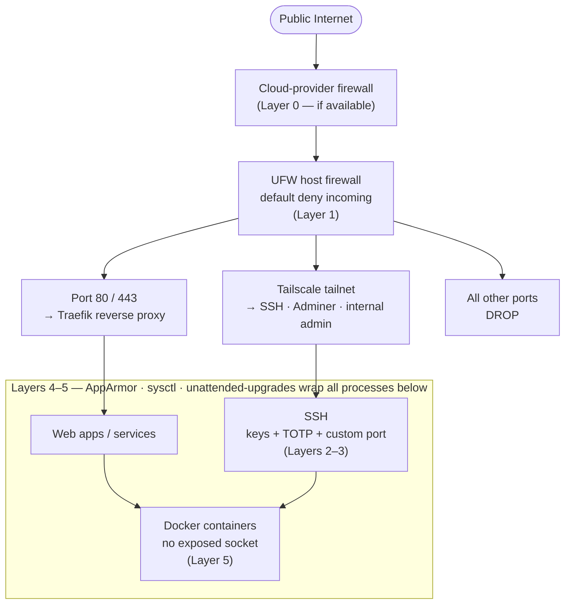

# VPS Hardening Playbook

> A reference + executable playbook for hardening a Debian/Ubuntu VPS aimed at small-team or personal use. Each control is structured **What → Why → How → Verify** so it's equally usable as a reading reference and as an LLM-driven runbook.

**Tested on:** Ubuntu 24.04 LTS on Contabo. Mostly portable to Debian 12+, Ubuntu 22.04+, and any cloud provider (Hetzner, DigitalOcean, AWS Lightsail, etc.). Where commands diverge for non-Debian distros, it's noted inline.

**Out of scope:** enterprise compliance regimes (CIS Level 2, STIG, PCI-DSS), HIDS at scale (Wazuh, OSSEC), centralised log shipping (ELK/Loki), and rootless container migrations. Those are useful at larger scale; this playbook is calibrated for "a few VPS instances I personally administer."

---

## Table of contents

0. [Scope, audience, threat model](#0-scope-audience-threat-model)
1. [Pre-flight — read before touching anything](#1-pre-flight--read-before-touching-anything)
2. [The layered-defence model](#2-the-layered-defence-model)
3. [Phase 1 — Foundation](#3-phase-1--foundation)
4. [Phase 2 — Network perimeter](#4-phase-2--network-perimeter)
5. [Phase 3 — SSH hardening](#5-phase-3--ssh-hardening)
6. [Phase 4 — Two-factor authentication (TOTP)](#6-phase-4--two-factor-authentication-totp)
7. [Phase 5 — Lock down access](#7-phase-5--lock-down-access)
8. [Phase 6 — OS / kernel hardening](#8-phase-6--os--kernel-hardening)
9. [Phase 7 — Intrusion detection & monitoring](#9-phase-7--intrusion-detection--monitoring)
10. [Phase 8 — Container hardening (Docker)](#10-phase-8--container-hardening-docker)
11. [Post-hardening verification checklist](#11-post-hardening-verification-checklist)
12. [Recovery: what to do if you lock yourself out](#12-recovery-what-to-do-if-you-lock-yourself-out)
13. [References](#13-references)

---

## 0. Scope, audience, threat model

### Audience

You: solo dev / small-team running 1–10 VPS instances for personal projects, side-business infra, hobby services. You SSH from a known set of devices, ideally over a private overlay network (Tailscale / WireGuard / ZeroTier).

### Threat model — what we're defending against

| Threat | Likelihood | This playbook's answer |
|---|---|---|
| Drive-by SSH brute-force from random IPs | **Very high** (constant on any public IP) | Tailscale + UFW interface-scoping makes sshd invisible publicly; key-only auth + TOTP makes it unbreakable even if exposed |
| Public-facing service vulns (n8n, web app, etc.) being exploited | High | TLS via Traefik, narrow firewall, AppArmor, regular patching |
| Account compromise via leaked SSH key | Medium | TOTP second factor; key passphrase |
| Supply-chain compromise of a dependency / package | Medium | unattended-upgrades, debsums, AppArmor confinement |
| Insider misuse (rare for solo) | Low | use_pty in sudoers, audit logs |
| Physical access / cloud-provider compromise | Low | Out of scope — full-disk-encryption helps but most VPS don't expose it |

### What "good enough" looks like

Five layers of defence such that **any single failure is recoverable**:

1. Network reachability (Tailscale + cloud-provider FW)
2. Host firewall (UFW)
3. SSH access (keys + TOTP + custom port + AllowUsers)
4. OS hardening (sysctl, AppArmor, patching)
5. Application/container isolation (AppArmor profiles, no exposed Docker socket)

If you've done all five, an attacker needs to compromise multiple independent layers to get in.

---

## 1. Pre-flight — read before touching anything

**Before you change SSH or firewall settings, ensure you have a recovery path.** A locked-out VPS is salvageable, but it's stressful.

### Recovery checklist

- [ ] You can reach the **cloud-provider web console** (Contabo VPS Control, AWS Console, Hetzner Robot, etc.) and have logged in once recently.
- [ ] You know the password for that console account.
- [ ] You know the **root password** OR have console-mounted recovery (Contabo: Web Console; AWS: SSM Session Manager / EC2 Instance Connect).
- [ ] You have **at least two open SSH sessions** when changing sshd config — one to apply changes, one as a safety net. The custom-port step (§5.3) requires a third to test the new port while keeping both existing sessions open.
- [ ] You've run `sudo sshd -t` to validate config syntax **before** restarting sshd.
- [ ] Backup `/etc/ssh/`, `/etc/sudoers`, `/etc/sudoers.d/`, and `/etc/pam.d/sshd`:
  ```
  sudo cp -a /etc/ssh /root/etc-ssh.bak.$(date +%F)
  sudo cp -a /etc/sudoers /etc/sudoers.d /root/sudoers.bak.$(date +%F)
  sudo cp -a /etc/pam.d/sshd /root/sshd-pam.bak.$(date +%F)
  ```

### Things that have locked people out

1. Restarting sshd with `Match` blocks in a broken state (config valid syntactically, but Match excludes you).
2. UFW reset on a remote box without re-allowing SSH.
3. Setting `AllowUsers someuser` and that user not existing or not having keys.
4. Binding sshd to an overlay IP (`ListenAddress 100.x.x.x`) on a host where the overlay may not come up.
   **On socket-activated Ubuntu 24.04 this is less dangerous than it sounds** — the shipped
   `ssh.socket` sets `FreeBind=yes`, which lets systemd bind an address that does not exist yet,
   so boot ordering against `tailscaled` is already handled. Verify before relying on it:
   `systemctl show ssh.socket -p FreeBind`. On a classic (non-socket) sshd, or with `FreeBind=no`,
   the original warning stands: sshd fails to bind and you lose remote access.
5. **Overlay node-key expiry.** Tailscale device keys expire (~180 days by default). When the key
   lapses the host silently drops off the tailnet — and if sshd is bound tailnet-only, or UFW only
   allows SSH on the overlay interface, that is a *total* lockout with no public port to fall back
   on. This is the most likely lockout in an overlay-only setup, and it fires months after the
   change that caused it. **Disable key expiry for servers before binding overlay-only** (§4.2).
6. Editing `ListenAddress`/`Port` and then running only `systemctl reload ssh` on a socket-activated
   box — the listener does not change, so you believe a restriction is in force when it is not.
   Use `daemon-reload` + `restart ssh.socket`, then confirm with `ss -tlnp` (§5.3).
7. Locking root password before confirming sudo works for the unprivileged user.

The phase sequence below is designed specifically to avoid all of these.

---

## 2. The layered-defence model


```mermaid
flowchart TD
    I([Public Internet]) --> CF["Cloud-provider firewall\n(Layer 0 — if available)"]
    CF --> UFW["UFW host firewall\ndefault deny incoming\n(Layer 1)"]
    UFW --> P80["Port 80 / 443\n→ Traefik reverse proxy"]
    UFW --> TS["Tailscale tailnet\n→ SSH · Adminer · internal admin"]
    UFW --> DROP["All other ports\nDROP"]
    P80 --> APPS["Web apps / services"]
    TS --> SSH["SSH\nkeys + TOTP + custom port\n(Layers 2–3)"]

    subgraph HOST["Layers 4–5 — AppArmor · sysctl · unattended-upgrades wrap all processes below"]
        APPS
        SSH
        APPS --> DK["Docker containers\nno exposed socket\n(Layer 5)"]
        SSH --> DK
    end
```

The principle: **no single misconfiguration should expose the whole box.**

---

## 3. Phase 1 — Foundation

*Do this first. You're still logged in as root from the cloud-provider console or initial SSH on port 22.*

### 3.1 Create a non-root sudo user

**What:** An unprivileged user account that escalates to root via sudo when needed.

**Why it protects:** Forces an extra authentication step for privileged actions. Attackers know "root" is a valid username on every Linux box — a named user is one more layer to defeat. Cleaner audit trail too.

**How (as root):**
```bash
adduser <YOUR-USERNAME>
usermod -aG sudo <YOUR-USERNAME>
mkdir -p /home/<YOUR-USERNAME>/.ssh
cp ~/.ssh/authorized_keys /home/<YOUR-USERNAME>/.ssh/
chown -R <YOUR-USERNAME>:<YOUR-USERNAME> /home/<YOUR-USERNAME>/.ssh
chmod 700 /home/<YOUR-USERNAME>/.ssh
chmod 600 /home/<YOUR-USERNAME>/.ssh/authorized_keys
```

**Verify:**
```bash
# From a second terminal, test login as the new user before continuing:
ssh <YOUR-USERNAME>@vps
sudo -v     # confirm sudo works
```

**Don't close your root session** until you confirm the new user can log in and sudo.

### 3.2 No empty passwords

**What:** Ensure no account has an empty password field in `/etc/shadow`.

**Why it protects:** An empty password = passwordless login wherever PAM accepts password auth. One empty account on a shared system can mean total compromise.

**Verify:**
```bash
sudo awk -F: '$2==""{print "EMPTY:"$1}' /etc/shadow
# Should output nothing.
```

If any output appears, set a password for that account or lock it: `sudo passwd -l <username>`.

### 3.3 `~/.ssh` permissions

**What:** Restrict who can read your SSH keys and config.

**Why it protects:** OpenSSH refuses to use keys or configs that are world/group-readable. Loose permissions also let a co-located user steal your keys.

**How:**
```bash
chmod 700 ~/.ssh
chmod 600 ~/.ssh/authorized_keys ~/.ssh/id_* ~/.ssh/config 2>/dev/null
chmod 644 ~/.ssh/*.pub ~/.ssh/known_hosts 2>/dev/null
```

**Verify:**
```bash
ls -la ~/.ssh
# Directory:                          drwx------
# Private keys / config / auth_keys: -rw-------
```

---

## 4. Phase 2 — Network perimeter

*Set up your outer layers before hardening SSH. SSH changes then happen inside a protected network.*

### 4.1 Cloud-provider firewall (if available)

**What:** A firewall enforced by the cloud provider before traffic reaches your VM.

**Why it protects:** Defence in depth — even if your host firewall is misconfigured or off, traffic is blocked at the provider edge. Especially valuable during boot (host firewall isn't up yet). **The killer feature: it sits *upstream* of the VM, so — unlike UFW — Docker cannot bypass it.** A container published to `0.0.0.0` writes its own iptables rules that slip under UFW (§10.3), but those rules live *inside* the box; the provider edge filters before traffic ever reaches them. So a default-deny cloud firewall is the one layer that reliably contains an accidental `0.0.0.0` Docker publish.

**How:**
- AWS: Security Groups (free, mandatory)
- GCP: VPC firewall rules
- Hetzner Cloud: Firewalls (free)
- DigitalOcean: Cloud Firewalls (free)
- **Contabo: Cloud Firewall (free, configured in the web panel) — see §4.1.1**
- Vultr: Firewall Groups

Configure: deny all incoming except 80, 443, and your SSH port. For private overlay setups, even SSH can be blocked at the provider level (see §4.1.1 and §7.1).

**Verify:** From a non-allowed network, attempt to connect to the VPS. Should time out at the provider edge before reaching the host. Verify from a *genuinely external* vantage point, not the box itself — a box cannot reliably test its own external reachability (see §11).

#### 4.1.1 Contabo Cloud Firewall (worked example)

Contabo now ships a free **Cloud Firewall**, configured in the customer panel (not on the box). *Older guides — including earlier versions of this one — said "Contabo has no provider firewall"; that is out of date.* It's stateful and **default-deny inbound**; you build a rule set and attach it to the VPS. A typical small-server rule set:

| Action | Proto | Port | Source | Why |
|---|---|---|---|---|
| Allow | TCP | 80 | Any (v4+v6) | ACME http-01 cert renewal + http→https redirect |
| Allow | TCP | 443 | Any (v4+v6) | HTTPS (reverse-proxy front door) |
| Allow | TCP | `<SSH-PORT>` | Any *(or your admin IP)* | SSH — **omit this rule to make SSH tailnet-only** (see below) |
| Allow | UDP | 41641 | Any (v4+v6) | Tailscale's WireGuard transport (only if you use Tailscale) |
| Allow | ICMP | — | Any (v4+v6) | ping + IPv6 path-MTU discovery |
| **Drop** | Any | Any | Any | default-deny — put last |

- **Sources: use "Any" (both IPv4 *and* IPv6).** A box with a public IPv6 serves on it, so an IPv4-only rule silently half-breaks reachability — and ICMPv6 is required for IPv6 path-MTU discovery, so scope ICMP to "Any" too.
- **Leave outbound unrestricted** (Contabo's default). Egress is what lets Tailscale reach its control plane / DERP relays, ACME reach Let's Encrypt, and apt fetch updates. Lock it down only if you know exactly what the box calls out to.
- **Tailnet-only SSH, the easy way:** just *don't* add the `<SSH-PORT>` rule. With Tailscale's UDP 41641 allowed, SSH still reaches you over the tunnel (it surfaces on `tailscale0` from inside, never as public TCP), but the public internet can't touch the SSH port at all. This is the cloud-firewall equivalent of §7.1 and avoids the boot-order lockout risk of §7.6.
- **This is also your Docker backstop.** Because the edge sits above Docker, any container port you didn't explicitly allow here is unreachable from the internet even if it's published to `0.0.0.0` (§10.3). Keep 127.0.0.1 binding as the primary control and treat the firewall as the automatic safety net.
- **Fronting the origin with a CDN?** If your public sites sit behind Cloudflare (or another proxy), tighten the 80/443 `Source` from "Any" to the CDN's published IP ranges, so nobody can reach your origin directly by IP — and note that with DNS-01 certificates you no longer need port 80 open at all. See §10.8 (origin lockdown) and §10.9 (DNS-01).

### 4.2 Private overlay network (Tailscale)

**What:** A point-to-point encrypted mesh that gives your devices private IPs (e.g. `100.x.x.x`) regardless of physical network.

**Why it protects:**
- SSH and admin services can be reachable **only over the overlay** — public attackers can't even establish a TCP connection to them.
- Roaming-friendly: you reach your VPS the same way from home, office, and mobile.
- Identity-based access (each device has its own auth key).

**How:**
```bash
# On the VPS
curl -fsSL https://tailscale.com/install.sh | sh
sudo tailscale up
# You'll get a URL — authenticate the device against your Tailscale account.

# Ensure tailscaled starts automatically on boot:
sudo systemctl enable tailscaled
```

**Verify:**
```bash
tailscale status
tailscale ip -4               # e.g. 100.x.x.x
systemctl is-enabled tailscaled   # must be "enabled" — critical for §7.6
```

From a tailnet peer (your laptop), ping the VPS by its tailscale name: `ping vps-myhost`.

**Disable node-key expiry on servers — do this BEFORE §7.1 or §7.6.**

Tailscale device keys expire (~180 days by default). On a laptop that just means
re-authenticating. On a headless server whose *only* SSH path is the tailnet, expiry silently
drops the host off the network and locks you out completely — months after you set it up, with
no obvious connection to the change that caused it.

```bash
# Check this host's expiry (null / "None" = disabled, which is what you want on a server)
tailscale status --json | grep -i keyexpiry

# Check every device at once — catches peers that have already lapsed
tailscale status   # look for "offline, last seen ..." on hosts you expect to be up
```

Disable it in the admin console: **login.tailscale.com → Machines → `<HOST>` → ⋯ →
*Disable key expiry***. There is no CLI equivalent; it is a control-plane setting.

Re-verify afterwards — `KeyExpiry` should come back null:
```bash
tailscale status --json | grep -i keyexpiry
```

> The local daemon reports what it has synced from the control plane. If the value has not
> changed, confirm in the admin console rather than assuming propagation lag.

**Caveats:**
- Tailscale relies on its control plane. If Tailscale goes down on the VPS and SSH is bound only to the tailnet IP (§7.6), you need the cloud console to recover.
- **Confirm your provider's out-of-band console works before you need it.** A web/VNC console is the
  only recovery path once SSH is overlay-only. Many providers let you disable it — which is good
  hygiene, since it bypasses SSH entirely — but then verify you can re-enable it on demand, and
  that the account protecting it has MFA.
- Free tier: up to 100 devices — more than enough for personal/small-team.

### 4.3 UFW — host firewall

**What:** UFW (Uncomplicated Firewall) wraps `iptables`/`nftables`. Default-deny incoming, default-allow outgoing.

**Why it protects:** Stops any service that accidentally listens on a public interface (forgotten dev daemon, misconfigured Docker port) from being reachable from the internet.

**How:**
```bash
sudo apt install ufw
sudo ufw default deny incoming
sudo ufw default allow outgoing
sudo ufw default deny routed       # don't route Docker traffic by default

# Allow web traffic
sudo ufw allow 80/tcp
sudo ufw allow 443/tcp

# Allow SSH on port 22 for now — you'll move to a custom port in Phase 3 (§5.3)
sudo ufw allow 22/tcp

sudo ufw logging medium
sudo ufw enable
```

**Verify:**
```bash
sudo ufw status verbose
# Status: active
# Default: deny (incoming), allow (outgoing), deny (routed)
# 22/tcp   ALLOW IN   Anywhere
# 80/tcp   ALLOW IN   Anywhere
# 443/tcp  ALLOW IN   Anywhere
```

**Note:** You'll narrow the SSH rule to the Tailscale interface in Phase 5 (§7.1) once SSH is on its custom port and Tailscale is confirmed stable.

### 4.4 Auditing an already-running box — justify every open port

**What:** On a fresh server you *build* the firewall from nothing. On a box
that's been running for a while, the firewall and the set of listening daemons
have accreted over time — old experiments, software that auto-opened a port on
install, a remote-desktop tool you forgot about. Before trusting the perimeter,
**enumerate what's actually open and account for each item.**

**Why it protects:** The most common real-world exposure isn't a missing
control — it's a *forgotten* one. A UFW `ALLOW` rule someone added months ago,
or a daemon that bound `0.0.0.0` on install, is an open door nobody remembers.
This step is what turns "UFW is enabled" into "I know exactly what's reachable
and why."

**How:**
```bash
# 1. List every public listener (TCP + UDP, IPv4 + IPv6) WITH the owning process
sudo ss -tulnp | grep -E '0\.0\.0\.0:|\[::\]:'

# 2. For any port you can't immediately name, trace it to a process/package
sudo lsof -i :4000                     # what's holding the port
ps -p <PID> -o pid,ppid,user,cmd       # what it is + who runs it
sudo ss -tulnp | grep ':4000'          # confirm the bind address

# 3. List every UFW ALLOW rule and ask "why is this here?"
sudo ufw status numbered

# 4. Cross-check: is every ALLOW rule backed by a service you intend to expose,
#    and is every public listener backed by an ALLOW rule you intend to keep?
```

For **each** open port, decide: *keep* (intended public service — e.g. 443),
*scope down* (bind to localhost/Tailscale, or restrict the UFW rule to your IP),
or *remove* (stop the service **and** delete the now-orphaned UFW rule). A
listener with no matching ALLOW rule is harmless-but-confusing; an ALLOW rule
with no matching service is a hole waiting for the next thing that grabs that
port.

**Verify:**
```bash
# The end state: only the ports you can name out loud are open.
sudo ss -tulnp | grep -E '0\.0\.0\.0:|\[::\]:'   # e.g. just 22/80/443 + intended
sudo ufw status numbered                          # every rule maps to a live, intended service
```

> Real example this playbook was distilled from: a `ufw status` showed
> `4000/tcp`, `4000/udp`, and `5353/udp` open. Tracing them
> (`ss -tulnp` → `lsof -i :4000`) revealed a NoMachine remote-desktop daemon and
> avahi/mDNS — neither needed on a headless VPS. They were removed and the rules
> deleted. Nothing in a from-scratch checklist would have flagged them; only
> *justifying every existing open port* did.

---

## 5. Phase 3 — SSH hardening

*Harden SSH access. Use at least two open sessions and run `sshd -t` before every restart.*

### 5.1 SSH key authentication

**What:** Authenticate using public-key cryptography instead of passwords.

**Why it protects:** A 256-bit Ed25519 keypair cannot be brute-forced. The private key never leaves your client; the server only ever sees a signature.

**How (on your client machine, not the VPS):**
```bash
ssh-keygen -t ed25519 -C "you@laptop"
# Use a strong PASSPHRASE — protects the key if your laptop is stolen.
ssh-copy-id -p 22 user@vps
```

**Verify:**
```bash
ssh -p 22 user@vps    # should not prompt for a password
```

### 5.2 Disable password authentication

**What:** Tell sshd to refuse password-based logins entirely.

**Why it protects:** Eliminates brute-force as an attack vector. Even a weak password becomes irrelevant.

**How:** Add to `/etc/ssh/sshd_config.d/99-local.conf`:
```
PasswordAuthentication no
PermitEmptyPasswords no
```

Then validate and restart:
```bash
sudo sshd -t && sudo systemctl restart ssh
```

**Verify:**
```bash
sudo sshd -T | grep -i passwordauth     # passwordauthentication no
```
Try: `ssh -o PreferredAuthentications=password -p 22 user@vps` — should fail.

> **Trap — cloud-init override:** cloud images (incl. Contabo) ship `/etc/ssh/sshd_config.d/50-cloud-init.conf` containing `PasswordAuthentication yes`. sshd takes the **first** value across the numerically-sorted drop-ins, so `50-cloud-init.conf` **wins over your `99-local.conf`** and password auth silently stays *on*. Fix it at the source and stop cloud-init re-enabling it on the next boot:
> ```bash
> sudo sed -i 's/^PasswordAuthentication.*/PasswordAuthentication no/' /etc/ssh/sshd_config.d/50-cloud-init.conf
> echo 'ssh_pwauth: false' | sudo tee /etc/cloud/cloud.cfg.d/99-disable-ssh-pwauth.cfg
> sudo systemctl reload ssh
> ```
> Always confirm with the *effective* value (`sudo sshd -T | grep -i passwordauth`), never just your own drop-in file.

### 5.3 Custom SSH port

**What:** Move sshd off port 22.

**Why it protects:** "Security through obscurity" — won't stop a targeted attacker, but eliminates ~99% of automated bot traffic. Cleaner logs are a real operational benefit.

**How:**

**First, check how sshd is started** — this decides *where* the port lives:
```bash
systemctl is-active ssh.socket                     # "active" → socket-activated (Ubuntu 24.04+ often is)
systemctl show ssh.socket -p DropInPaths --value   # which file actually feeds the socket
```
- `ssh.socket` **inactive** → classic path (edit `sshd_config`), below.
- `ssh.socket` **active** → the port is owned by the *socket unit*. **Which file feeds that socket decides whether `sshd_config` still matters** — see the two sub-cases below.

> **Two socket-activated sub-cases — check `DropInPaths` before editing anything.**
> Ubuntu 24.04's `openssh-server` ships `/usr/lib/systemd/system-generators/sshd-socket-generator`,
> which *reads* `sshd_config` and writes `/run/systemd/generator/ssh.socket.d/addresses.conf`.
>
> | `DropInPaths` contains | Authoritative source | `sshd -T` trustworthy? |
> |---|---|---|
> | only `/run/systemd/generator/…` | **`sshd_config`** — `Port` and `ListenAddress` *do* work | yes |
> | `/etc/systemd/system/ssh.socket.d/…` | **that manual drop-in** — `sshd_config` is ignored | no |
>
> `/etc` drop-ins outrank generator output, so the manual method below *creates* the second
> case. Both are valid — just know which one you're in.
>
> **In either case, `systemctl reload ssh` will NOT change the listening address.** The
> generator only re-runs on `daemon-reload`:
> ```bash
> sudo systemctl daemon-reload && sudo systemctl restart ssh.socket
> ```
> Reloading sshd alone leaves the old listener in place with no error — the classic way to
> believe you're protected when you aren't. Always confirm with `ss -tlnp` afterwards.

**Classic (sshd_config-controlled) sshd:**
```bash
# 1. Add new UFW rule BEFORE changing the port (otherwise you lock yourself out)
sudo ufw allow <SSH-PORT>/tcp

# 2. Add the new port ALONGSIDE 22 (keep both during the transition; drop 22 later)
printf 'Port 22\nPort <SSH-PORT>\n' | sudo tee /etc/ssh/sshd_config.d/49-ssh-port.conf

# 3. Validate + restart (keep at least TWO sessions open — see §1)
sudo sshd -t && sudo systemctl restart ssh

# 4. From a THIRD terminal, confirm the new port works — keep the old sessions open
ssh -p <SSH-PORT> user@vps

# 5. Only after that succeeds: set the drop-in to just `Port <SSH-PORT>`, reload, drop the 22 rule
sudo ufw delete allow 22/tcp
```
> Adding *only* `Port <SSH-PORT>` when 22 was merely the default (no explicit `Port` line anywhere) **drops 22** — list both during the transition so you never cut your only way in.

**Socket-activated sshd (Ubuntu 24.04+):** the listening port lives in `ssh.socket`. Two traps here, both real lockouts:
> **Trap 1 — wrong file:** *once the manual drop-in below exists*, editing `Port` in `sshd_config` has no effect — `/etc/systemd/system/ssh.socket.d/` outranks the generator. On a stock box with no manual drop-in, `sshd_config` still drives the socket (see the sub-case table in §5.3). Check `DropInPaths` to know which applies.
> **Trap 2 — IPv6-only:** the base `ssh.socket` sets `BindIPv6Only=ipv6-only`, so a bare `ListenStream=<SSH-PORT>` binds **IPv6 only** and silently drops IPv4. You *must* list both address families.
```bash
# 1. Allow the new port at UFW (and at your cloud firewall)
sudo ufw allow <SSH-PORT>/tcp

# 2. Add <SSH-PORT> ALONGSIDE 22 via a socket drop-in — BOTH v4 and v6 (ListenStream is additive)
sudo install -d /etc/systemd/system/ssh.socket.d
printf '[Socket]\nListenStream=0.0.0.0:<SSH-PORT>\nListenStream=[::]:<SSH-PORT>\n' \
  | sudo tee /etc/systemd/system/ssh.socket.d/10-add-port.conf
sudo systemctl daemon-reload && sudo systemctl restart ssh.socket   # does NOT drop live sessions

# 3. Confirm it listens on BOTH families and 22 is still up
sudo ss -tlnp | grep -E ':22 |:<SSH-PORT> '   # expect four lines (22 + <SSH-PORT>, each on 0.0.0.0 and [::])

# 4. From a NEW terminal, prove the new port before removing anything
ssh -p <SSH-PORT> user@vps

# 5. Only then drop 22: reset the list (empty ListenStream=) and re-add ONLY <SSH-PORT>
printf '[Socket]\nListenStream=\nListenStream=0.0.0.0:<SSH-PORT>\nListenStream=[::]:<SSH-PORT>\n' \
  | sudo tee /etc/systemd/system/ssh.socket.d/10-add-port.conf
sudo systemctl daemon-reload && sudo systemctl restart ssh.socket
sudo ufw delete allow 22/tcp
```

(Pick something in 1024–65535. Avoid common service ports: 8080, 3306, 5432, etc.)

**Verify:**
```bash
sudo ss -tlnp | grep <SSH-PORT>     # listening on the new port (both v4 + v6)
sudo ufw status verbose             # 22 gone, <SSH-PORT> present
```

> **Note — when `sshd -T` can be trusted under socket activation.** It reports what
> `sshd_config` says, which is only the truth if `sshd_config` is what feeds the socket:
>
> - **Generator-driven box** (`DropInPaths` shows only `/run/systemd/generator/…`) — `sshd -T`
>   is accurate, because the generator derived the socket addresses from that same config.
> - **Manual drop-in present** (`/etc/systemd/system/ssh.socket.d/…`) — `sshd -T` reports the
>   `sshd_config` values while the socket listens on the drop-in's. It will happily print
>   `port 22` while the box actually listens elsewhere.
>
> `ss -tlnp` and `systemctl show ssh.socket -p Listen` are authoritative in **both** cases —
> prefer them when the two disagree.

**Caveat — RHEL/Fedora:** SELinux needs `semanage port -a -t ssh_port_t -p tcp <SSH-PORT>`. Ubuntu/Debian (no SELinux by default) doesn't.

**Caveat — fail2ban:** if fail2ban is already installed, its `[sshd]` jail defaults to port `ssh` (22). After moving the port, set `port = <SSH-PORT>` in the jail so bans apply to the new port (see §9.1).

### 5.4 Disable root SSH login

**What:** Prevent anyone from logging in as root over SSH.

**Why it protects:** Attackers always try root — it's guaranteed to exist. A named non-root user + sudo is one more unknown to defeat.

**How:** Add to `/etc/ssh/sshd_config.d/99-local.conf`:
```
PermitRootLogin no
```

Then validate and restart:
```bash
sudo sshd -t && sudo systemctl restart ssh
```

**Verify:**
```bash
sudo sshd -T | grep permitroot    # permitrootlogin no
ssh -p <SSH-PORT> root@vps             # should fail
```

> **Belt & suspenders:** stock `/etc/ssh/sshd_config` ships `PermitRootLogin yes` (often ~line 42). Your `99-local.conf` overrides it only by include-order/first-match — so if that drop-in were ever removed or renamed, root SSH would silently re-open. Set the base file too: `sudo sed -i 's/^PermitRootLogin yes/PermitRootLogin no/' /etc/ssh/sshd_config`.

### 5.5 Restrict to specific users (AllowUsers)

**What:** Whitelist which users can authenticate over SSH.

**Why it protects:** Even if a system service account ever gets a login shell by accident, sshd will reject it outright.

**How:** Add to `/etc/ssh/sshd_config.d/99-local.conf`:
```
AllowUsers <YOUR-USERNAME>
# AllowGroups ssh-users    # alternative for multi-admin setups
```

Then validate and restart:
```bash
sudo sshd -t && sudo systemctl restart ssh
```

**Verify:**
```bash
sudo sshd -T | grep -i allowusers    # allowusers <YOUR-USERNAME>
ssh -p <SSH-PORT> nobody@vps              # should fail with "Permission denied"
```

---

## 6. Phase 4 — Two-factor authentication (TOTP)

*Add a phone-based second factor. After this phase, login requires key + passphrase + TOTP code.*

**Keep at least two SSH sessions open during this phase** — sshd restarts are required and you need a safety net if the PAM config is wrong.

### 6.1 TOTP via PAM (Google Authenticator / Aegis / 1Password)

**What:** A 6-digit rotating code as a mandatory second factor on top of key auth.

**Why it protects:** If your private key is stolen and the passphrase is bypassed (e.g. malware on your laptop), the attacker still can't get in without your phone.

**How:**
```bash
# 1. Install PAM module
sudo apt install libpam-google-authenticator

# 2. As the SSH user (not root), generate the secret
google-authenticator
# Answer:
#   - time-based?      yes
#   - update file?     yes
#   - disallow reuse?  yes
#   - rate limit?      yes
#   - window?          yes
# Scan the QR with your authenticator app. SAVE THE RECOVERY CODES in your password manager.

# 3. Enable TOTP in PAM — insert AFTER @include common-auth in /etc/pam.d/sshd
#    The guard prevents double-insertion if you re-run this step.
grep -q 'pam_google_authenticator' /etc/pam.d/sshd || \
  sudo sed -i '/^@include common-auth/a auth required pam_google_authenticator.so' /etc/pam.d/sshd

# 4. Configure sshd to invoke PAM keyboard-interactive
sudo tee -a /etc/ssh/sshd_config.d/99-local.conf <<'EOF'
KbdInteractiveAuthentication yes
UsePAM yes
EOF

# 5. Validate + restart
sudo sshd -t && sudo systemctl restart ssh
```

**Verify:** Open a new SSH session — you should be prompted for a verification code after key auth. Auth log should show:
```
sshd(pam_google_authenticator)[...]: Accepted google_authenticator for <user>
sshd[...]: Accepted keyboard-interactive/pam for <user> ...
```
Check the log directly:
```bash
sudo grep 'google_authenticator\|keyboard-interactive' /var/log/auth.log | tail -5
```

**Recovery codes:** When you ran `google-authenticator`, it gave 5 emergency scratch codes. Each is single-use. Losing your phone without them means losing SSH access — use the cloud console to disable TOTP (`mv ~/.google_authenticator ~/.google_authenticator.disabled`).

### 6.2 AuthenticationMethods: require both key AND TOTP

**What:** Tells sshd that a successful login requires *all* listed methods, not any one of them.

**Why it protects:** Without this directive, sshd may accept key *or* TOTP independently. You want key *and* TOTP.

**How:** Add to `/etc/ssh/sshd_config.d/99-local.conf`:
```
AuthenticationMethods publickey,keyboard-interactive
```

Then restart:
```bash
sudo sshd -t && sudo systemctl restart ssh
```

**Verify:**
```bash
sudo sshd -T | grep -i authenticationmethods
# authenticationmethods publickey,keyboard-interactive
```

---

## 7. Phase 5 — Lock down access

*Narrow SSH's exposure surface. Each step reduces what an attacker can do or reach.*

### 7.1 Scope UFW SSH rule to Tailscale interface

**What:** Replace the public SSH allow rule with an interface-scoped one on `tailscale0`.

**Why it protects:** Public traffic to the SSH port now hits UFW's default-deny before reaching sshd. Only traffic arriving via the Tailscale interface passes through. Even if an attacker knows your port number, they can't reach it.

**How:**
```bash
# Remove the public rule
sudo ufw delete allow <SSH-PORT>/tcp

# Add tailscale-scoped rule
sudo ufw allow in on tailscale0 to any port <SSH-PORT> proto tcp

sudo ufw reload
```

**Verify:**
```bash
sudo ufw status verbose
# <SSH-PORT> on tailscale0   ALLOW IN    Anywhere

# From a non-tailnet network:
nc -vz <public-ip> <SSH-PORT>    # should time out
# From a tailnet peer:
ssh -p <SSH-PORT> vps             # should connect
```

**Alternative / complement — do it at the cloud firewall instead.** If your provider has a cloud firewall (§4.1.1), the cleanest way to make SSH tailnet-only is to simply **not allow the SSH port at the edge** (while allowing Tailscale's UDP 41641). SSH then arrives only through the tunnel, the public internet can't reach the port at all, and there's no `tailscale0`-scoped UFW rule to maintain. It also sidesteps §7.6's boot-order lockout risk. Doing it at the edge *and* in UFW is fine belt-and-braces.

### 7.2 MaxAuthTries

**What:** Limit authentication attempts per connection.

**Why it protects:** Default is 6. Lowering to 3 reduces the window during bad-key or wrong-TOTP situations.

**How:** Add to `/etc/ssh/sshd_config.d/99-local.conf`:
```
MaxAuthTries 3
```

Then validate and restart:
```bash
sudo sshd -t && sudo systemctl restart ssh
```

**Verify:**
```bash
sudo sshd -T | grep maxauthtries    # maxauthtries 3
```

### 7.3 ClientAliveInterval / ClientAliveCountMax

**What:** Server-side keepalive. Disconnects unresponsive sessions after a timeout.

**Why it protects:** Stale sessions left open on a compromised laptop are a forever-open back door. A 10-minute unresponsive timeout cleans them up.

**How:** Add to `/etc/ssh/sshd_config.d/99-local.conf`:
```
ClientAliveInterval 300
ClientAliveCountMax 2
# → disconnects after ~10 min of an unresponsive client
```

Then validate and restart:
```bash
sudo sshd -t && sudo systemctl restart ssh
```

**Verify:**
```bash
sudo sshd -T | grep -i clientalive
# clientaliveinterval 300
# clientalivecountmax 2
```

### 7.4 Disable X11 forwarding

**What:** Turn off X11 and optionally TCP port forwarding.

**Why it protects:** Reduces what a compromised SSH session can do — e.g. tunnelling traffic from the server to arbitrary internal hosts.

**How:** Add to `/etc/ssh/sshd_config.d/99-local.conf`:
```
X11Forwarding no
# Only set these to 'no' if you DON'T use SSH tunnelling:
# AllowTcpForwarding no
# AllowAgentForwarding no
```

Then validate and restart:
```bash
sudo sshd -t && sudo systemctl restart ssh
```

**Verify:**
```bash
sudo sshd -T | grep x11forwarding    # x11forwarding no
```

**Note:** If you tunnel internal services (e.g. `ssh -L 5432:127.0.0.1:5432 vps` to access a containerised Postgres), keep `AllowTcpForwarding yes`.

### 7.5 SSH cryptographic algorithm tightening

**What:** Restrict which Ciphers / MACs / KexAlgorithms / HostKeyAlgorithms sshd advertises. Drop weak/legacy ones.

**Why it protects:** Ubuntu's default sshd advertises known-weak algorithms (`hmac-sha1`, `umac-64`, NIST-curve ECDSA). They widen the attack surface and fail compliance scans.

**Reference:** Mozilla SSH Guidelines + ssh-audit recommendations.

**How:** Add to `/etc/ssh/sshd_config.d/99-local.conf`:
```
HostKeyAlgorithms ssh-ed25519,ssh-ed25519-cert-v01@openssh.com,sk-ssh-ed25519@openssh.com,sk-ssh-ed25519-cert-v01@openssh.com,rsa-sha2-512,rsa-sha2-256
KexAlgorithms sntrup761x25519-sha512@openssh.com,curve25519-sha256,curve25519-sha256@libssh.org,diffie-hellman-group16-sha512,diffie-hellman-group18-sha512
Ciphers chacha20-poly1305@openssh.com,aes256-gcm@openssh.com,aes128-gcm@openssh.com,aes256-ctr,aes192-ctr,aes128-ctr
MACs hmac-sha2-512-etm@openssh.com,hmac-sha2-256-etm@openssh.com,umac-128-etm@openssh.com
PubkeyAcceptedAlgorithms ssh-ed25519,ssh-ed25519-cert-v01@openssh.com,sk-ssh-ed25519@openssh.com,sk-ssh-ed25519-cert-v01@openssh.com,rsa-sha2-512,rsa-sha2-256
```

Then validate and restart:
```bash
sudo sshd -t && sudo systemctl restart ssh
```

**Verify (from a tailnet peer or your laptop):**
```bash
pipx install ssh-audit
ssh-audit -p <SSH-PORT> <vps-ip>
# Want all-green or near-green.
```

**Caveats:**
- Removing `ssh-rsa` breaks clients older than OpenSSH 8.0 (2019). Modern clients are fine.
- Removing `diffie-hellman-group14-sha256` may break WinSCP < 5.20 and similar legacy clients.

### 7.6 Bind sshd to Tailscale interface only (defence in depth)

**What:** Tell sshd to listen only on the Tailscale IP, not all interfaces.

**Why it protects:** Belt + braces. Even if UFW is accidentally disabled, sshd is invisible to anything not on the tailnet.

**Critical caveat — highest lockout risk in this guide:** If Tailscale fails to start after a reboot and sshd is bound to its IP, SSH is completely unavailable. The cloud console is your **only** recovery path. Before proceeding:

1. **Disable node-key expiry for this host (§4.2).** A lapsed key drops the box off the tailnet
   months later and locks you out exactly as hard as tailscaled failing. Do this first:
   ```bash
   tailscale status --json | grep -i keyexpiry    # want null / "None"
   ```
2. Confirm `tailscaled` is enabled at boot and has survived at least one reboot:
   ```bash
   systemctl is-enabled tailscaled    # must be "enabled"
   tailscale status                   # must be "Running"
   ```
3. If you haven't rebooted since installing Tailscale, do so now and confirm it comes back before continuing.
4. Have your cloud-provider console open and ready — and if you keep it disabled by default,
   confirm you can re-enable it (§4.2).
5. Keep at least two SSH sessions open while applying this step.

**How:**
```bash
TS4=$(tailscale ip -4)
TS6=$(tailscale ip -6)
sudo cp /etc/ssh/sshd_config /etc/ssh/sshd_config.bak-$(date +%Y%m%d-%H%M%S)
sudo tee -a /etc/ssh/sshd_config.d/99-local.conf <<EOF

ListenAddress $TS4
ListenAddress $TS6
EOF
sudo sshd -t || echo "INVALID — restore the backup, do not proceed"
```

Then apply it **the way that matches how sshd is started** (§5.3) — this is where people get a
false sense of security:

```bash
# Socket-activated (Ubuntu 24.04+, generator-driven): reloading sshd does NOTHING here.
sudo systemctl daemon-reload && sudo systemctl restart ssh.socket

# Classic (non-socket) sshd:
sudo systemctl restart ssh
```

Existing sessions survive both — socket-activated connections are separate processes, so
restarting the socket only changes what is accepted *next*.

**Verify — prove the listener, don't read the config:**
```bash
ss -tlnp | grep -E ':<SSH-PORT>'
# Expect ONLY the overlay addresses. No 0.0.0.0, no [::].

# Empirical check from the box itself — bash's /dev/tcp needs no extra packages:
timeout 5 bash -c 'exec 3<>/dev/tcp/<OVERLAY-IP>/<SSH-PORT>' && echo "overlay: OPEN" || echo "overlay: closed"
timeout 5 bash -c 'exec 3<>/dev/tcp/<PUBLIC-IP>/<SSH-PORT>'  && echo "public v4: OPEN (unexpected)" || echo "public v4: closed"
timeout 5 bash -c 'exec 3<>/dev/tcp/<PUBLIC-IPV6>/<SSH-PORT>' && echo "public v6: OPEN (unexpected)" || echo "public v6: closed"
```

> **What that actually proves.** Run from the box, these test whether a *socket is bound* to each
> address — they do **not** test firewall reachability, because traffic to your own address never
> leaves the host. That is exactly what you want here: binding is the property under test, and a
> "closed" result means no listener exists on the public IP at all, independent of any firewall.
> To test the firewall too, connect from an external host.

**Finally, open a NEW session over the overlay and complete a full login before closing the old
one.** A successful TCP handshake only proves the socket answers; it does not exercise the key +
TOTP path.

### 7.7 Remove forgotten / unnecessary services (headless-server blind spots)

**What:** Hunt down and remove daemons that have no business running on a
headless, single-purpose VPS but quietly listen anyway. Three categories account
for most surprises:

**Why it protects:** Every running daemon is attack surface. The dangerous ones
are those you didn't install deliberately or have forgotten — they don't show up
when you reason about "my stack," only when you enumerate what's actually
running. These are exactly the things §4.4's port audit surfaces; this section is
how you clean them up.

**A. `systemd --user` services (incl. lingering).** User-level services keep
running after you log out if *lingering* is enabled — a persistence vector that
hides from `systemctl list-units` (the system manager) entirely.
```bash
# Enumerate per-user services and who has lingering enabled
systemctl --user list-units --type=service        # run as the user
loginctl list-users
loginctl user-status <user> | grep -i linger

# Remove one you don't want:
systemctl --user disable --now <name>.service
loginctl disable-linger <user>                     # if nothing else needs it
```

**B. Remote-desktop daemons.** NoMachine (`nxd`), xrdp, x11vnc/tigervnc,
AnyDesk, TeamViewer — full GUI login surfaces, usually password-auth, often
internet-facing on install. On a headless box managed over SSH they're pure
liability.
```bash
# Detect
dpkg -l | grep -Ei 'nomachine|xrdp|x11vnc|tigervnc|vino|anydesk|teamviewer'
sudo ss -tulnp | grep -E ':4000|:3389|:590[0-9]'   # NX / RDP / VNC ports

# Remove (NoMachine example — purge the package, drop its firewall rules)
sudo /usr/NX/bin/nxserver --stop 2>/dev/null
sudo apt-get purge -y nomachine
sudo rm -rf /usr/NX
sudo ufw delete allow 4000/tcp; sudo ufw delete allow 4000/udp
```

**C. avahi / mDNS (5353).** Service discovery for LANs. On a public VPS it
serves no purpose and broadcasts info; it also listens on UDP 5353 (which a
TCP-only port scan misses — see §4.4).
```bash
sudo systemctl disable --now avahi-daemon.service avahi-daemon.socket
# or remove outright: sudo apt-get purge -y avahi-daemon
sudo ufw delete allow 5353/udp 2>/dev/null
```

**Verify:**
```bash
sudo ss -tulnp | grep -E '0\.0\.0\.0:|\[::\]:'    # the daemon's ports are gone
systemctl --user list-units --type=service         # no unexpected user services
dpkg -l | grep -Ei 'nomachine|xrdp|vnc|anydesk|teamviewer'   # empty
```

---

## 8. Phase 6 — OS / kernel hardening

*System-wide controls that limit damage from any compromised process.*

### 8.1 Automatic security updates (unattended-upgrades)

**What:** Automatically install security patches without manual intervention.

**Why it protects:** Closes the window between CVE disclosure and patch installation. Most compromised servers run known-vulnerable software.

**How:**
```bash
sudo apt install unattended-upgrades
sudo dpkg-reconfigure -plow unattended-upgrades   # answer Yes

# Enable auto-reboot so kernel updates actually apply:
sudo tee -a /etc/apt/apt.conf.d/50unattended-upgrades <<'EOF'

Unattended-Upgrade::Automatic-Reboot "true";
Unattended-Upgrade::Automatic-Reboot-WithUsers "true";
Unattended-Upgrade::Automatic-Reboot-Time "04:00";
EOF
```

**Note:** `Automatic-Reboot-WithUsers "true"` means the VPS **will reboot at 04:00 even with active sessions**. Any open `tmux`/`screen` sessions or running scripts will be killed. If you need to prevent this during specific windows, temporarily set it to `"false"` and re-enable afterward.

> **`04:00` in whose timezone?** The **system's** — not yours. Providers commonly image VPSes in
> their own datacentre region, so a box you administer from another country can sit hours away
> from your local time. A "quiet 4 AM reboot" then lands in the middle of your working day.
> ```bash
> timedatectl                       # the system timezone every scheduled job resolves against
> date; TZ=<YOUR-TZ> date           # compare system time to yours
> ```
> Either set the box to a timezone you reason in (`sudo timedatectl set-timezone <TZ>` — note this
> shifts *all* log timestamps), or convert deliberately and write the offset in a comment next to
> every scheduled entry.
>
> **`CRON_TZ` will not save you on Debian/Ubuntu.** It is a *cronie* (RHEL-family) extension.
> Debian/Ubuntu `cron` (3.0pl1) does not implement it, does not warn, and silently runs the job
> at the system timezone instead — so a crontab that *looks* correctly localised runs hours off.
> ```bash
> man 5 crontab | grep -c CRON_TZ   # 0 on Debian/Ubuntu ⇒ unsupported, remove the line
> ```
> Verify with reality, not intent: have the job log `date` on each run and check that the recorded
> times match what you expected. If you genuinely need a fixed wall-clock time in a specific zone
> regardless of DST, use a systemd timer — `OnCalendar` accepts an explicit timezone
> (`OnCalendar=*-*-* 03:00:00 <TZ>`, systemd 252+) — rather than cron.

**Verify:**
```bash
systemctl is-active unattended-upgrades        # active
systemctl is-enabled unattended-upgrades       # enabled
sudo unattended-upgrades --dry-run --debug | tail -20
grep 'Automatic-Reboot' /etc/apt/apt.conf.d/50unattended-upgrades
ls /var/run/reboot-required 2>&1               # should not exist after auto-reboot
```

**Note:** Postgres major-version upgrades are NOT applied automatically — they stay in the security pocket. Major upgrades remain manual. That's intentional.

### 8.2 AppArmor (Mandatory Access Control)

**What:** Per-application security profiles that constrain what files/network/syscalls a process can use, even if running as root.

**Why it protects:** A compromised service (e.g. a CVE in nginx) is contained — the attacker can't escape the profile to read `/etc/shadow` or pivot to other services.

**How:** AppArmor is preinstalled and active on Ubuntu by default. Verify:
```bash
sudo aa-status
# Should show "apparmor module is loaded" + N profiles in enforce mode.
sudo systemctl is-active apparmor    # active
```

For Docker, the `docker-default` AppArmor profile is automatically applied to containers.

**Verify Docker confinement:**
```bash
sudo aa-status | grep docker-default    # in enforce mode
```

**Caveat — RHEL/Fedora/CentOS:** SELinux instead of AppArmor. Don't disable it — same defence-in-depth purpose.

### 8.3 Sysctl: network hardening

**What:** Kernel networking knobs that reject malformed or suspicious packets.

**Why each protects:**

| Setting | What | Why |
|---|---|---|
| `net.ipv4.tcp_syncookies = 1` | SYN cookies | Mitigates SYN-flood DoS |
| `net.ipv4.conf.all.rp_filter = 1` | Reverse-path filter | Drops packets with spoofed source IPs |
| `net.ipv4.conf.all.accept_source_route = 0` | Refuse source-routed packets | Old IP feature, used for bypassing routing rules |
| `net.ipv4.conf.all.accept_redirects = 0` | Refuse ICMP redirects | Defends against MITM re-routing attempts |
| `net.ipv4.conf.all.send_redirects = 0` | Don't send ICMP redirects | Hosts shouldn't act like routers |
| `net.ipv4.conf.all.log_martians = 1` | Log spoofed packets | Visibility into spoofing attempts |
| `net.ipv4.icmp_echo_ignore_broadcasts = 1` | Ignore ICMP-broadcast pings | Prevents Smurf-attack amplification |

**How:**
```bash
sudo tee /etc/sysctl.d/99-network-hardening.conf <<'EOF'
net.ipv4.tcp_syncookies = 1
net.ipv4.conf.all.rp_filter = 1
net.ipv4.conf.default.rp_filter = 1
net.ipv4.conf.all.accept_source_route = 0
net.ipv4.conf.default.accept_source_route = 0
net.ipv4.conf.all.accept_redirects = 0
net.ipv4.conf.default.accept_redirects = 0
net.ipv6.conf.all.accept_redirects = 0
net.ipv6.conf.default.accept_redirects = 0
net.ipv4.conf.all.send_redirects = 0
net.ipv4.conf.default.send_redirects = 0
net.ipv4.conf.all.log_martians = 1
net.ipv4.conf.default.log_martians = 1
net.ipv4.icmp_echo_ignore_broadcasts = 1
EOF
sudo sysctl --system
```

**Verify:**
```bash
sysctl net.ipv4.tcp_syncookies net.ipv4.conf.all.rp_filter \
  net.ipv4.conf.all.send_redirects net.ipv4.conf.all.log_martians \
  net.ipv4.conf.all.accept_redirects net.ipv4.conf.all.accept_source_route
# All should show the hardened values set above.
```

> **Gotcha — UFW re-applies its own sysctl and overrides `log_martians`.** `/etc/default/ufw` sets `IPT_SYSCTL=/etc/ufw/sysctl.conf`, and that file ships `net/ipv4/conf/all/log_martians=0`. Because `ufw` starts *after* `systemd-sysctl`, it **resets `log_martians` back to 0** on every boot — your value is silently lost (keys UFW doesn't touch, like `rp_filter`, survive, which is what makes this easy to miss). Fix it at UFW's source:
> ```bash
> sudo sed -i 's#^net/ipv4/conf/all/log_martians=0#net/ipv4/conf/all/log_martians=1#' /etc/ufw/sysctl.conf
> sudo sed -i 's#^net/ipv4/conf/default/log_martians=0#net/ipv4/conf/default/log_martians=1#' /etc/ufw/sysctl.conf
> sudo systemctl reload ufw
> ```

### 8.4 Sysctl: filesystem hardening

**What:** Kernel knobs that prevent file-system race-condition exploits.

**Why each protects:**

| Setting | What | Why |
|---|---|---|
| `fs.protected_hardlinks = 1` | Restrict hardlink creation | Prevents `/tmp` race-condition file overwrites |
| `fs.protected_symlinks = 1` | Restrict symlink follow in `/tmp` | Same class of attacks |
| `fs.suid_dumpable = 0` | Disable core dumps from SUID binaries | Prevents leaking memory contents of privileged programs |

**How:**
```bash
sudo tee /etc/sysctl.d/99-fs-hardening.conf <<'EOF'
fs.protected_hardlinks = 1
fs.protected_symlinks = 1
fs.protected_fifos = 1
fs.protected_regular = 1
fs.suid_dumpable = 0
EOF
sudo sysctl --system
```

**Verify:**
```bash
sysctl fs.protected_hardlinks fs.protected_symlinks \
  fs.protected_fifos fs.protected_regular fs.suid_dumpable
# fs.protected_hardlinks = 1
# fs.protected_symlinks = 1
# fs.protected_fifos = 1
# fs.protected_regular = 1
# fs.suid_dumpable = 0
```

> **Gotcha — `apport` resets `suid_dumpable` to 2 at boot.** Ubuntu's crash reporter re-enables SUID core dumps *after* `systemd-sysctl` runs, so `fs.suid_dumpable = 0` won't stick while apport is active. Servers don't need apport — disabling it also removes a crash-handling attack surface:
> ```bash
> sudo systemctl disable --now apport
> sudo sed -i 's/^enabled=1/enabled=0/' /etc/default/apport
> ```

### 8.5 Sysctl: kernel info-leak hardening

**What:** Hide kernel addresses and diagnostics from unprivileged users.

**Why each protects:**

| Setting | What | Why |
|---|---|---|
| `kernel.kptr_restrict = 2` | Hide kernel pointers everywhere | Prevents address leaks for KASLR bypass |
| `kernel.dmesg_restrict = 1` | dmesg requires root | dmesg can leak addresses and hardware info |
| `kernel.unprivileged_bpf_disabled = 2` | Disable unprivileged BPF (locked) | Removes a major kernel-attack surface; value 2 = cannot be changed even by root at runtime |
| `net.core.bpf_jit_harden = 2` | Harden BPF JIT | Defence against JIT-spray attacks |
| `kernel.randomize_va_space = 2` | Full ASLR | Already default on Ubuntu; confirm it's set |

**How:**
```bash
sudo tee /etc/sysctl.d/99-kernel-hardening.conf <<'EOF'
kernel.kptr_restrict = 2
kernel.dmesg_restrict = 1
kernel.unprivileged_bpf_disabled = 2
net.core.bpf_jit_harden = 2
kernel.randomize_va_space = 2
EOF
sudo sysctl --system
```

**Verify:**
```bash
sysctl kernel.kptr_restrict kernel.dmesg_restrict \
  kernel.unprivileged_bpf_disabled net.core.bpf_jit_harden \
  kernel.randomize_va_space
# kernel.kptr_restrict = 2
# kernel.dmesg_restrict = 1
# kernel.unprivileged_bpf_disabled = 2
# net.core.bpf_jit_harden = 2
# kernel.randomize_va_space = 2
```

### 8.6 Lock the root password

**What:** Mark the root account as having no usable password.

**Why it protects:** Eliminates root password auth via Linux console, recovery mode, or any path that asks for a password. You still reach root via your unprivileged user + sudo.

**How:**
```bash
# Confirm sudo works first:
sudo -v

# Then lock root:
sudo passwd -l root
```

**Verify:**
```bash
sudo passwd -S root
# root L ...   (L = locked)
```

**Recovery:** Cloud console → recovery / single-user mode → `passwd -u root` to unlock.

### 8.7 Sudoers hygiene

**What:** Best-practice settings in `/etc/sudoers`.

**Why it protects:**

| Setting | Why |
|---|---|
| `Defaults env_reset` | Don't pass user env to sudo commands (prevents `LD_PRELOAD` tricks) |
| `Defaults secure_path=...` | Use a known PATH for sudo, not the user's PATH |
| `Defaults use_pty` | Run in a pseudo-tty (better logging, blocks some TIOCSTI attacks) |
| `Defaults mail_badpass` | Email root on sudo password failures |
| `Defaults logfile=/var/log/sudo.log` | Log all sudo invocations |

**How:** These are mostly default on Ubuntu 22.04+. Verify:
```bash
sudo grep -E '^Defaults' /etc/sudoers
```

If `use_pty` is missing, add via `sudo visudo`:
```
Defaults  use_pty
Defaults  logfile="/var/log/sudo.log"
```

**Caveat — NOPASSWD entries:** Avoid `NOPASSWD:ALL` for human users. Cloud-init may add this for the initial user in `/etc/sudoers.d/90-cloud-init-users`. Check and remove it:
```bash
sudo cat /etc/sudoers.d/*
# If you see `your_user ALL=(ALL) NOPASSWD:ALL`, edit it out via visudo.
```

**Verify:**
```bash
sudo grep -E '^Defaults' /etc/sudoers         # env_reset, secure_path, use_pty present
sudo grep -r 'NOPASSWD' /etc/sudoers.d/       # should be empty or expected entries only
```

### 8.8 On-box credentials — your server's own keys are a lateral-movement surface

**What:** Inventory the secrets the box itself holds — outbound SSH keys, cloud
credentials, API tokens, `.env` files — and scope each to least privilege. This
is about what an attacker gets to do *next* if they ever land on this host.

**Why it protects:** Every hardening control above is about keeping attackers
*out*. This one limits the *blast radius* if one ever gets in. A box that stores
a passwordless private key, a cloud credential, or an account-wide GitHub key
hands the attacker a second target for free. The server's outbound credentials
are part of its threat model, not just its inbound exposure.

**How:**
```bash
# 1. Find private keys and credential files on the box
ls -la ~/.ssh/                                    # private keys, config
grep -rIl 'PRIVATE KEY' ~ 2>/dev/null             # stray private keys anywhere in $HOME
ls -la ~/.aws ~/.config/gcloud ~/.kube ~/.docker/config.json 2>/dev/null
find ~ -maxdepth 3 -name '.env' -o -name '*.pem' 2>/dev/null | grep -v node_modules

# 2. See what the box's SSH keys can REACH (so you know the blast radius)
grep -E 'Host |IdentityFile' ~/.ssh/config 2>/dev/null

# 3. Check whether each private key is actually ENCRYPTED (passphrase-protected).
#    A passphraseless key on disk is a free pivot for anyone who lands on the box.
for k in ~/.ssh/*; do grep -qI 'PRIVATE KEY' "$k" 2>/dev/null || continue; \
  ssh-keygen -y -P '' -f "$k" >/dev/null 2>&1 && echo "UNENCRYPTED: $k" || echo "encrypted:   $k"; done
```

For each credential found, apply least privilege:
- **GitHub access:** prefer a **read-only, per-repository deploy key** scoped to
  only the repos the box needs — *not* a key tied to your whole personal account
  (which grants read/push to every repo you can touch, a supply-chain risk).
  For multi-repo push, use a dedicated least-privilege machine-user.
- **Interactive SSH keys:** add a passphrase and load via `ssh-agent` rather than
  leaving a passphraseless key on disk.
- **Cloud creds / tokens:** scope to the minimum IAM permissions; rotate; prefer
  short-lived/instance credentials over long-lived static keys where available.
- **`.env` files:** ensure `chmod 600`, never world-readable, never committed.
- **Provider "app passwords":** treat as full-account credentials, not scoped ones. A mail-provider
  app password typically **bypasses the account's MFA by design** (that is its purpose) and grants
  *read* access to the mailbox, not just send. Since a mailbox receives password-reset links for
  everything else, a leaked one is an account-takeover primitive. Prefer a transactional provider
  with a genuinely scoped, send-only API key. If you must use one, know that rotating it means
  **revoking the old entry** — issuing a new one does not invalidate the old.

**Container environment variables are a credential store — and a readable one.**

Secrets passed to containers via `environment:`/`--env` are stored in plaintext in the container
config and visible to anyone who can talk to the Docker socket. Membership of the `docker` group
is root-equivalent (§10), so "only the docker group can read it" is not the reassurance it sounds
like — and the same values are exposed via `/proc/<pid>/environ` to root.

```bash
# Inventory WHICH containers carry credential-shaped variables — names only, never values
for c in $(docker ps --format '{{.Names}}'); do
  n=$(docker inspect "$c" --format '{{range .Config.Env}}{{println .}}{{end}}' 2>/dev/null \
      | grep -icE '^[A-Z_]*(PASS|PASSWD|PASSWORD|SECRET|TOKEN|KEY|CRED|AUTH|DSN)[A-Z_]*=')
  [ "$n" -gt 0 ] && echo "$c: $n credential-shaped env var(s)"
done
```

Prefer file-based secrets (Docker/Swarm secrets, or a mounted `600` file the app reads) over
environment variables where the application supports it.

> **Convention — print key names, never values.** When auditing or logging secrets, do not try to
> *redact* values with a pattern; enumerate the keys and print those alone. Redaction lists are a
> losing game: a filter matching `PASSWORD|KEY|SECRET|TOKEN` silently misses `PASS`, `PWD`,
> `CRED`, `DSN`, and anything else you did not think of, and one miss writes a live credential
> into a log, terminal scrollback, or transcript that then has to be treated as compromised.
> Grep for the *names*, and use `stat`/counts to describe the values.

**Create secrets owner-only, don't fix them afterwards.**

Any script that writes a dump, backup, or key should set `umask 077` *before* creating the file
rather than `chmod 600`-ing it afterwards. Create-then-chmod leaves a window — often on a default
`umask 002`, i.e. group-writable — during which the file is readable by others, and the window
lasts as long as the write takes. Database dumps are the common case: they contain everything the
database holds.

```bash
( umask 077
  pg_dump ... | gzip > "$BACKUP_DIR/dump-$(date +%Y%m%d-%H%M%S).sql.gz" )
```

Also `chmod 700` the directory itself, and re-check perms periodically — a script that relies on
the ambient umask will silently start producing world-readable files if it is ever run from a
different context (cron vs. an interactive shell can differ).

**Verify:**
```bash
ls -la ~/.ssh/                # private keys are 600; you can name what each is for
grep -E 'Host |IdentityFile' ~/.ssh/config   # every IdentityFile maps to an intended, scoped target
find <BACKUP-DIR> -type f ! -perm 600        # any backup not owner-only is a finding
```

> Real example: this box held `~/.ssh/<key>` that `~/.ssh/config` mapped to
> `Host github.com` — i.e. the VPS authenticated as the owner's *entire personal
> GitHub account*. Not server-to-server access, but a breach would expose every
> repo that account could reach (and allow malicious pushes). The fix is to swap
> it for a read-only per-repo deploy key — shrinking the blast radius from "whole
> account" to "these specific repos."

---

### 8.9 Swap, zswap, and OOM containment

**What:** A swap file, zswap in front of it, and cgroup memory limits on the things most likely to run away.

**Why it protects:** A box with no swap has no graceful degradation — it goes straight from "under memory pressure" to the kernel shooting processes, and the kernel picks badly. A real incident on one of these boxes killed `systemd` and `dbus-daemon`, neither of which had anything to do with the process that exhausted memory. Availability is part of the threat model: a box that OOM-loops is as down as one that was breached.

**How:**
```bash
# 1. Swap file. Sizing: this is an OOM cushion, not hibernation space.
#    8G suits a 4-16G box; on a 32G+ box 4G is plenty, since if you are
#    routinely 32G deep you have a capacity problem, not a swap problem.
sudo fallocate -l 8G /swapfile        # ext4. On XFS use dd - fallocate leaves
sudo chmod 600 /swapfile              # unwritten extents that mkswap rejects.
sudo mkswap /swapfile
sudo swapon -p 10 /swapfile           # -p matches the fstab priority below;
                                      # without it you get the default (-2)
echo '/swapfile none swap sw,pri=10 0 0' | sudo tee -a /etc/fstab

# 2. zswap - a COMPRESSED CACHE IN FRONT OF SWAP. With no swap device it does
#    nothing at all, so the swap file above is a prerequisite, not an option.
#    Runtime (immediate, lost on reboot):
for p in "zstd compressor" "zsmalloc zpool" "25 max_pool_percent" "1 enabled"; do
  set -- $p; echo "$1" | sudo tee /sys/module/zswap/parameters/$2 >/dev/null
done
#    Persistent (needs a reboot to take effect):
sudo sed -i 's/^\(GRUB_CMDLINE_LINUX_DEFAULT="[^"]*\)"/\1 zswap.enabled=1 zswap.compressor=zstd zswap.zpool=zsmalloc zswap.max_pool_percent=25"/' /etc/default/grub
sudo update-grub

# 3. swappiness - TUNE PER WORKLOAD. This is not a one-size setting.
echo 'vm.swappiness = 100' | sudo tee /etc/sysctl.d/99-swappiness.conf
sudo sysctl -p /etc/sysctl.d/99-swappiness.conf
```

**swappiness by workload — do not blanket-apply:**

| Workload | Value | Why |
|---|---|---|
| General web / app / DB host | `100` | With zswap, swapping is RAM-speed and compressed. Being aggressive is cheap. |
| Realtime media (WebRTC, SFU, voice) | `10` | Swapping mid-call means jitter and audio artifacts. Swap should exist as an emergency backstop that is essentially never touched. |

**Verify:**
```bash
swapon --show                                  # device, size, PRIO
cat /sys/module/zswap/parameters/enabled       # Y
sudo grep -r . /sys/kernel/debug/zswap/        # stored_pages > 0 once it engages
sysctl vm.swappiness
```

#### Diagnosing an OOM — attribute the kill before you fix anything

The single most important step, and the one most often skipped. `Killed process … (next-server)` tells you the victim, not where it lived. **`task_memcg` tells you which cgroup it was in, and that decides which layer you fix.**

```bash
# Fast: -k limits to the kernel ring, --grep filters inside journald.
# A client-side `journalctl | grep` over a busy journal will time out.
sudo journalctl -k --since "14 days ago" \
  --grep "Out of memory|oom_reaper|Killed process" --no-pager | tail -20

# Count victims by name
sudo journalctl -k --since "14 days ago" --grep "Out of memory" --no-pager \
  | grep -oE 'Killed process [0-9]+ \(([^)]+)\)' \
  | sed 's/.*(\(.*\))/\1/' | sort | uniq -c | sort -rn
```

Read the cgroup on each kill:

| `task_memcg` contains | The offender lived in | Fix at |
|---|---|---|
| `/system.slice/docker-<id>.scope` | a container | `mem_limit` on that service (§10.11) |
| `/user.slice/user-<uid>.slice/...` | an interactive login — tmux, VS Code Server, a dev server | a limit on the **user slice** (below) |
| `constraint=CONSTRAINT_NONE … global_oom` | nothing hit its own cap; the **whole box** ran out | both, plus swap |

Getting this backwards wastes the fix. On one box here every large kill was `tmux-spawn-….scope` under `user.slice` — dev servers left running, not the production containers. Container limits would not have prevented a single one of them.

#### Limiting the user slice

On any box where someone logs in to work — VS Code Server, tmux, language servers, browser automation — that activity is uncapped by default and can OOM-kill production alongside it.

```bash
sudo systemctl set-property user-$(id -u).slice MemoryHigh=5G MemoryMax=7G
```

`MemoryHigh` throttles and reclaims under pressure; `MemoryMax` is the hard ceiling where the kernel kills **inside the slice**. Production containers never feel it.

Set `MemoryHigh` **above current usage** or you throttle from the moment it applies:

```bash
systemctl show user-$(id -u).slice -p MemoryCurrent -p MemoryHigh -p MemoryMax
```

Budget so that `user slice max + container totals + ~1G host` stays under physical RAM.

**Note — the real fix is often workflow, not config.** If a production host is also someone's development workstation, the editor, its extensions, npx packages and agent tooling all run as the user that owns the production secrets and deploy keys. Limits contain the memory symptom; they do nothing about that.

---

## 9. Phase 7 — Intrusion detection & monitoring

*Set up detection and visibility. At this point your VPS is well protected; this phase surfaces anything that slips through.*

### 9.1 fail2ban

**What:** Watches logs for repeated failed logins and temporarily firewall-bans the source IP.

**Why it protects:** Slows brute-force attempts and surfaces compromised IPs scanning you. Not a primary defence (key-only SSH already prevents brute-force from succeeding), but good for log noise reduction and fail-loud behaviour on any public service.

**How:**
```bash
sudo apt install fail2ban

sudo tee /etc/fail2ban/jail.local <<'EOF'
[DEFAULT]
bantime  = 1h
findtime = 10m
maxretry = 5
backend  = systemd
banaction        = nftables
banaction_allports = nftables[type=allports]

[sshd]
enabled = true

[recidive]
enabled  = true
bantime  = 1w
findtime = 1d
maxretry = 3
EOF

sudo systemctl enable --now fail2ban
```

**Verify:**
```bash
sudo systemctl is-active fail2ban      # active
sudo fail2ban-client status            # lists active jails
sudo fail2ban-client status sshd       # sshd jail running
sudo fail2ban-client status recidive   # recidive jail running
```

**Note — custom SSH port:** the `[sshd]` jail matches failed-login log lines regardless of port, but its ban action is scoped to the port in the jail config, which defaults to `ssh` (22). If you moved SSH to a custom port (§5.3), add `port = <SSH-PORT>` under `[sshd]` so bans apply to the port attackers actually hit.

**Note:** If sshd is invisible to the public (UFW + Tailscale-only from Phase 5), fail2ban will have nothing to ban on sshd — which is exactly right. It still earns its place on any public-facing service (HTTP auth, mail, etc.).

**Note — `Total failed: 0` is not evidence of a broken jail.** On a key-only box (§5.2) the counter legitimately stays at zero: with `PasswordAuthentication no`, scanners are disconnected before they can present a password, so no `Failed password` line is ever written. The stock `sshd` filter in its default mode also ignores `Connection closed by authenticating user` — that pattern fires on ordinary aborted connections too, and only counts under `mode = aggressive`. A quiet counter on a custom port (§5.3) usually means the port is genuinely unattractive to scanners, not that detection is dead.

**Gotcha — the journalmatch looks broken and isn't.** `sudo fail2ban-client get sshd journalmatch` prints:

```
_SYSTEMD_UNIT=sshd.service + _COMM=sshd
```

On Ubuntu the SSH unit is `ssh.service` (socket-activated, logging as `ssh.service`), and `sshd.service` may not exist at all — so this reads like a filter that can never match. It matches fine: in systemd journal syntax `+` is **OR**, not AND. The `_COMM=sshd` clause alone catches every sshd event regardless of unit name. Do not "fix" this — the edit is a no-op at best.

**Prove the jail actually fires.** Config inspection cannot distinguish a working jail from a dead one; only a live event can. From a second host — never your only route in — make fewer than `maxretry` rejected logins and watch the counter move:

```bash
# On the target box — note the starting numbers
sudo fail2ban-client status sshd | grep -E "Currently failed|Total failed"

# From ANOTHER host: two rejected attempts, safely under maxretry = 5
for i in 1 2; do
  ssh -o BatchMode=yes -o ConnectTimeout=6 -p <SSH-PORT> nosuchuser@<TARGET-IP> true
done

# Back on the target — the counter MUST increase
sudo fail2ban-client status sshd | grep -E "Currently failed|Total failed"
```

Stay under `maxretry` so no ban is issued, and run it from a host you can afford to have banned. The counters age out after `findtime`, so there is nothing to undo.

### 9.2 Audit trail: check who logged in

**What:** Reviewing `last`, `lastb`, and auth.log for unexpected access.

**Why it protects:** Detection. You can't prevent every breach, but you can notice one.

**How:**
```bash
last -i -n 50                                           # successful logins
sudo lastb -i -n 50                                     # failed logins
sudo grep -E 'Accepted|Failed|Invalid' /var/log/auth.log | tail -100
```

Build a habit: check these monthly, after returning from a long trip, or any time something feels off.

**Verify:** No unexpected source IPs in `last` output. No unexpected usernames in failed logins. If you see an unfamiliar IP that successfully authenticated, treat it as a security incident.

### 9.3 ssh-audit (one-shot SSH config scan)

**What:** Scans your sshd's advertised crypto and config and reports weak items.

**How (from a separate machine):**
```bash
pipx install ssh-audit
ssh-audit -p <SSH-PORT> <vps-ip>
```

**Verify:** Want all-green after Phase 5's crypto tightening. Anything yellow or red — read its remediation tip.

### 9.4 lynis (system-wide baseline audit)

**What:** Comprehensive Linux security baseline scanner. Outputs a "hardening index" score + per-control suggestions.

**How:**
```bash
sudo apt install lynis
sudo lynis audit system
```

**Verify:** Hardening index ≥ 80 is excellent for a personal VPS. Skim "Suggestions" output and apply the non-noisy ones.

**Periodic:** Run monthly via cron, diff against last run, alert on regressions.

### 9.5 Log retention

**What:** Ensure you can look back 30+ days for forensics.

**How:** `/var/log/auth.log` and `/var/log/syslog` rotate via `logrotate`. Defaults rotate weekly and keep 4 weeks — fine for most cases. Tune in `/etc/logrotate.d/rsyslog` if you need longer.

Cap journald disk usage in `/etc/systemd/journald.conf`:
```
SystemMaxUse=500M
```

Then reload:
```bash
sudo systemctl restart systemd-journald
```

**Verify:**
```bash
journalctl --disk-usage
# Archived and active journals take up X.XG on disk.
grep 'SystemMaxUse' /etc/systemd/journald.conf    # 500M
```

### 9.6 (optional) auditd

**What:** Kernel-level audit subsystem. Records execve, file access, and syscalls per a configured ruleset.

**Why it protects:** Forensic audit trail. After an incident, auditd logs are gold.

**How:**
```bash
sudo apt install auditd audisp-plugins
# Use a ruleset like Neo23x0/auditd or Ubuntu CIS — drop into /etc/audit/rules.d/
sudo systemctl enable --now auditd
```

**Verify:**
```bash
sudo systemctl is-active auditd    # active
sudo auditctl -l                   # lists active audit rules
```

**Caveat:** Generates significant log volume. Only worth it if you have a SIEM or actively review logs.

### 9.7 (optional) debsums

**What:** Verifies installed package files match Debian's expected checksums. Detects tampered system binaries.

**How:**
```bash
sudo apt install debsums
sudo debsums --changed    # files that no longer match the package
```

**Verify:** Running `sudo debsums --changed` on a clean system should produce no output. Any output is a finding worth investigating — it may be a legitimate config change or a tampered binary.

**Periodic:** Weekly cron, alert on any output.

---

## 10. Phase 8 — Container hardening (Docker)

*If you run Docker. Skip this section if you don't.*

### 10.1 Don't expose the Docker daemon over TCP

**What:** Docker can listen on a TCP socket (ports 2375/2376). Don't enable that on a public-internet host.

**Why it protects:** An exposed Docker socket without TLS = trivial root on the host. Full stop.

**How:** Check that `/etc/docker/daemon.json` and the Docker systemd unit have no `tcp://` host argument. By default Docker listens only on `/var/run/docker.sock` (Unix socket), which is correct.

**Verify:**
```bash
sudo ss -tlnp | grep -E ':2375|:2376'
# Should output nothing.
```

### 10.2 docker group = root — understand the trade-off

**What:** Adding a user to the `docker` group lets them run `docker` without sudo. That user can do `docker run -v /:/host --privileged ...` and gain root on the host.

**Why it matters:** `docker` group membership is effectively root. Don't grant it to accounts you don't fully trust.

**Mitigation:** For a solo VPS where you are the docker user anyway, this is an acceptable trade-off. Rootless Docker or Podman eliminate it, but the migration cost is significant for personal infra.

**Verify:**
```bash
getent group docker
# docker:x:999:<YOUR-USERNAME>
# Review who's listed — should only be accounts you fully trust.
```

### 10.3 Don't bind container ports to 0.0.0.0

**What:** `docker run -p 5432:5432 ...` publishes Postgres to **every interface**, bypassing UFW. Docker manages its own iptables rules in the FORWARD chain and they take effect regardless of UFW rules.

**Why it protects:** Stops accidental internet exposure of internal services.

**How:** Bind to localhost or Tailscale interface explicitly:
```yaml
# docker-compose.yml
services:
  postgres:
    ports:
      - "127.0.0.1:5432:5432"     # localhost only — access via SSH tunnel
      # OR
      - "100.x.x.x:5432:5432"    # tailnet-only
```

For services that only communicate with other containers via Docker's internal network (e.g. n8n → Postgres), don't publish ports at all — use Docker's internal DNS.

**Verify:**
```bash
sudo ss -tulnp | grep -E '0\.0\.0\.0:|\[::\]:'    # only intended ports (TCP + UDP, IPv4 + IPv6)
```

> **Why `-tulnp` and both address forms:** a TCP-only/IPv4-only check
> (`ss -tlnp | grep 0.0.0.0:`) silently misses UDP services (mDNS/avahi on
> 5353, some remote-desktop daemons) and anything bound to `[::]` (IPv6). A
> forgotten daemon listening on `[::]:4000/udp` would pass the old check.

**UFW bypass defences (in order of preference):**
1. **Bind to `127.0.0.1`/tailscale as above — the primary control.** It prevents exposure at the source *and* protects the internal vectors (other containers, localhost) a firewall doesn't see.
2. **A cloud/provider firewall as the automatic backstop (§4.1).** It sits *upstream* of the box, so Docker's iptables rules can't bypass it — a default-deny edge blocks any `0.0.0.0` publish you didn't explicitly allow, even one added by a rogue or forgotten container. This is the layer that catches the mistake UFW silently lets through. Residual gaps: it can't distinguish a rogue container that grabs an *already-allowed* port (e.g. 443), and it only guards the internet edge — so keep #1 as well.
3. The [`ufw-docker`](https://github.com/chaifeng/ufw-docker) helper script (makes UFW actually govern Docker), or a `DOCKER-USER` iptables rule.
4. `"iptables": false` in `/etc/docker/daemon.json` — **advanced only**: disables Docker's automatic NAT, breaking container-to-container routing and Traefik's service discovery. Only if you're prepared to write all FORWARD rules manually.

> **Legit public container ports still go through the edge.** Some services genuinely need a public port that Docker publishes past UFW — e.g. a WebRTC media server (LiveKit: `7881/tcp` + `7882/udp`). Those must be **explicitly allowed at the cloud firewall**, and are a good reminder that the edge — not UFW — is where you reason about Docker exposure.

> **Prove it from *outside*, not from the box.** After locking a port down, don't trust a probe run *on* the server: hairpin NAT and Docker's own NAT make a box's self-probe of its public IP lie — it can reach its own listener locally even when the internet can't (and vice-versa). Verify from a genuinely external vantage — a multi-node online port scanner, or `nc`/SSH from a network that isn't yours — **and** confirm the box logged *zero* inbound. Quick proof: publish a throwaway listener on a non-allowed port (`docker run --rm -p 0.0.0.0:5599:5432 postgres:16-alpine`), scan it from outside (expect all-timeout), confirm the container logged no connection, then tear it down. One "connected" result with an impossible sub-5 ms latency from a far-away node is a middlebox false positive, not a real reach — cross-check against the box's own logs.

### 10.4 Keep AppArmor's docker-default profile in enforce

**What:** Docker automatically applies the `docker-default` AppArmor profile to containers.

**Why it protects:** A process running as root inside a container is still constrained by the profile.

**Verify:**
```bash
sudo aa-status | grep docker-default    # in enforce mode
```

### 10.5 Pin image versions

**What:** Don't run `:latest` for production services; pin to specific tags or digests and bump intentionally.

**Why it protects:** A surprise image change can introduce vulnerabilities or break trust assumptions. Pinned + reviewed bumps are supply-chain hygiene.

**How:**
```yaml
image: postgres:17.6           # specific minor version
# Or pin by digest for maximum strictness:
# image: postgres@sha256:...
```

**Verify:**
```bash
docker ps --format 'table {{.Image}}\t{{.Names}}'
# Review the Image column — no :latest tags should appear for persistent services.
```

### 10.6 Restrict admin UIs behind the reverse proxy

**What:** A reverse proxy (Traefik, Caddy, nginx) terminates TLS and routes to
containers — but TLS is *encryption*, not *authentication*. An admin UI exposed
through it (n8n editor, Portainer, Grafana, Adminer) is reachable by anyone on
the internet; the only barrier is that app's own login. Put a **network-layer**
gate in front of it.

**Why it protects:** Application logins get brute-forced, leak via CVEs, or sit
on default/weak credentials. For a UI only *you* use, there's no reason for the
whole internet to even reach the login page. The key distinction: **admin UIs
should be restricted; public endpoints (webhooks, the public site) must stay
open.** Split them onto separate routers so you can lock one without breaking the
other.

**How (Traefik labels — IP-allowlist on the admin router only):**
```yaml
labels:
  - "traefik.enable=true"

  # Public router — e.g. webhooks. Stays open to the world.
  - "traefik.http.routers.app-webhook.rule=Host(`hooks.example.com`)"
  - "traefik.http.routers.app-webhook.entrypoints=websecure"
  - "traefik.http.routers.app-webhook.tls.certresolver=letsencrypt"

  # Admin/editor router — restricted to your IP(s) via an allowlist middleware.
  - "traefik.http.routers.app-editor.rule=Host(`app.example.com`)"
  - "traefik.http.routers.app-editor.entrypoints=websecure"
  - "traefik.http.routers.app-editor.tls.certresolver=letsencrypt"
  - "traefik.http.routers.app-editor.middlewares=admin-allowlist"
  - "traefik.http.middlewares.admin-allowlist.ipallowlist.sourcerange=203.0.113.4/32,100.64.0.0/10"
```
- `sourcerange` = your static IP(s) and/or your Tailscale CGNAT range
  (`100.64.0.0/10`) so you reach it over the tailnet.
- No static IP? Use a **forward-auth** middleware (Authelia, tinyauth,
  oauth2-proxy) for an SSO/login gate at the proxy instead of an IP list.
- Belt-and-braces at the app layer: enable the app's **MFA**, ensure the
  first-run setup screen isn't still open, and disable unused public APIs
  (e.g. n8n `N8N_PUBLIC_API_DISABLED=true`).
- Public endpoints that must stay open (webhooks) should authenticate inbound
  requests themselves (signed/HMAC tokens), since you can't IP-restrict them.

**Verify:**
```bash
# From a NON-allowlisted network: the admin host should be blocked at the proxy.
curl -sI https://app.example.com/        # expect 403 (Forbidden) from Traefik
# The public host should still serve:
curl -sI https://hooks.example.com/      # expect 200/401 from the app, not 403
```

### 10.7 Data at rest & backups

**What:** Two things that hardening guides routinely skip but matter most when
you store real data: keeping it **encrypted at rest** and having **recoverable,
off-box backups**. Relevant to any persistent data store (Postgres, n8n, Redis,
uploaded files) — typically Docker volumes on this kind of box.

**Why it protects:** Perimeter hardening reduces the chance of compromise;
encryption and backups limit the *damage* when something goes wrong — a breach,
a bad `docker volume rm`, a disk failure, or a ransomware-style event. The
failure that hurts most in practice isn't a missing firewall rule; it's
discovering your only copy of client data is gone, or that a stolen DB dump was
plaintext.

**How:**
- **Application encryption keys:** many apps encrypt stored secrets only if a key
  is set. n8n: confirm `N8N_ENCRYPTION_KEY` is set (credentials in Postgres are
  encrypted with it) — **and back the key up separately**; lose it and the
  encrypted data is unrecoverable. Treat it like a password, not a config value.
  ```bash
  docker exec <n8n-container> printenv | grep -q N8N_ENCRYPTION_KEY \
    && echo "encryption key set" || echo "WARNING: no encryption key"
  ```
- **Know where the data lives:**
  ```bash
  docker volume ls
  docker inspect <db-container> --format '{{range .Mounts}}{{.Source}} -> {{.Destination}}{{println}}{{end}}'
  ```
- **Backups — encrypted, off-box, automated:** dump the DB, encrypt the dump,
  ship it off the server (object storage / another host). A backup that lives
  only on the same VPS dies with it.
  ```bash
  # Example: nightly encrypted Postgres dump pushed off-box
  docker exec <db-container> pg_dump -U <user> <db> \
    | gzip \
    | gpg --encrypt --recipient you@example.com \
    > /backups/db-$(date +%F).sql.gz.gpg
  # then sync /backups to off-box storage (rclone/restic/aws s3 cp ...)
  ```
  Prefer a tool like **restic** or **borg** (encrypted, deduplicated, incremental)
  for anything beyond a toy setup.
- **Test restores.** An untested backup is a hope, not a backup. Periodically
  restore into a throwaway container and confirm the data is intact.

**Verify:**
```bash
ls -lh /backups/                       # recent dumps exist
gpg --list-packets /backups/<latest>.gpg >/dev/null 2>&1 && echo "encrypted ✓"
# Off-box copy is current (check your remote: rclone lsl <remote>, restic snapshots, etc.)
# Restore drill: load the latest dump into a scratch DB and sanity-check row counts.
```

### 10.8 Put the origin behind a CDN/proxy and accept only its IPs (Cloudflare worked example)

**What:** When your public sites sit behind a CDN/proxy (Cloudflare, Fastly, Bunny),
visitors reach the *CDN* and the CDN reaches your *origin*. Anyone who discovers your
origin IP can still connect to it **directly** — bypassing the CDN's WAF, rate-limiting,
and bot protection. Close that door: make the origin accept 80/443 **only from the CDN's
published IP ranges**.

**Why it protects:** A proxied hostname hides your origin IP in DNS, but the IP leaks in
practice (stale DNS records, TLS certificate logs, email headers, mass scanning). Once it's
known, an attacker hits the origin directly and every protection you bought from the CDN is
skipped. Restricting the origin to the CDN's ranges drops direct-to-IP traffic, so the CDN
becomes the *only* way in.

**How — two layers.** Layer 0 is the real drop; Layer 7 is defence in depth.

*Layer 0 — cloud firewall (see §4.1.1).* Restrict inbound 80/443 to the CDN's ranges.
Cloudflare publishes them at `https://www.cloudflare.com/ips-v4` and `/ips-v6` (re-check
before pasting — they change rarely but they do change):
```
# Cloudflare IPv4
173.245.48.0/20 103.21.244.0/22 103.22.200.0/22 103.31.4.0/22 141.101.64.0/18
108.162.192.0/18 190.93.240.0/20 188.114.96.0/20 197.234.240.0/22 198.41.128.0/17
162.158.0.0/15 104.16.0.0/13 104.24.0.0/14 172.64.0.0/13 131.0.72.0/22
```
Set these as the **Source** on the 80 and 443 allow rules; the default `Block all` drops
everyone else.

*Layer 7 — Traefik `ipAllowList`.* So a firewall misconfig doesn't expose the origin. Because
the CDN proxies the connection, **the source IP Traefik sees *is* the CDN edge IP** — so the
default IP strategy is correct; no `depth`/`X-Forwarded-For` handling needed. Define it in a
dynamic-config file and attach it at the entrypoint so every router is covered:
```yaml
# dynamic/cdn-only.yml  (file provider)
http:
  middlewares:
    cdn-only:
      ipAllowList:
        sourceRange:            # the CDN's IPv4 + IPv6 ranges
          - 173.245.48.0/20
          - 2400:cb00::/32
          # ...the full list...
```
```yaml
# traefik.yml (static) — apply to every HTTPS router
entryPoints:
  websecure:
    address: ":443"
    http:
      middlewares:
        - "cdn-only@file"
```
Non-CDN sources now get **403** at the proxy.

**Two gotchas worth knowing:**
- **IPv6 bypass.** If your origin has a public IPv6 address and the proxy listens on it
  (`[::]:80/443`), an IPv4-only firewall rule leaves the v6 door open. If the CDN reaches
  your origin over IPv4 only (no `AAAA` record on the origin), bind the proxy's ports
  **IPv4-only** so there's no v6 listener to bypass — with Docker, specify the host IP:
  `- "0.0.0.0:443:443"` (see §10.3).
- **Port 80 is optional.** With the CDN's "always use HTTPS" enabled, the CDN does the
  http→https redirect at its *edge* and never touches your origin's port 80. Scope 80 to the
  CDN like 443, or drop it entirely — visitors are unaffected either way.

**Verify — from an *external, non-CDN* machine** (a second VPS, or a public TCP checker). A
test from the box itself hairpins and won't traverse the edge firewall, so it proves nothing:
```bash
# Direct to the origin IP, bypassing the CDN — should TIME OUT (firewall) or 403 (Traefik):
curl -sS -o /dev/null -w '%{http_code}\n' --resolve app.example.com:443:<origin-ip> \
  --connect-timeout 6 https://app.example.com || echo "blocked"
# Through the CDN — should still work:
curl -sI https://app.example.com | head -1        # expect 200/3xx
```

### 10.9 TLS issuance: prefer DNS-01 when the origin is locked down

**What:** Let's Encrypt proves you control a domain via a *challenge*. **HTTP-01** answers an
inbound request on port 80; **DNS-01** writes a temporary DNS `TXT` record. Once you've locked
the origin to a CDN (§10.8), prefer **DNS-01** — it depends on no inbound port.

**Why it protects:** HTTP-01 renewal only works while an inbound request can reach the origin
on port 80. Behind a locked/proxied origin that's fragile — a CDN edge redirect, a tightened
firewall rule, or an IPv4-only bind can silently break renewal, and you don't find out until a
certificate **expires ~90 days later**. DNS-01 proves control out-of-band (an outbound API call
that creates a `TXT` record), so renewal is independent of your inbound firewall — and it
unlocks wildcard certificates.

**How (Traefik + Cloudflare — native, no scripting):** Traefik bundles the `lego` ACME library
with built-in DNS providers, so DNS-01 is pure config:
```yaml
# traefik.yml (static)
certificatesResolvers:
  letsencrypt:
    acme:
      email: "you@example.com"   # literal — Traefik does NOT expand ${ENV} in static config
      storage: "/etc/traefik/acme.json"
      dnsChallenge:
        provider: cloudflare     # built-in; no plugin, no script
        resolvers: ["1.1.1.1:53"]
```
```yaml
# docker-compose.yml — the token reaches lego via the container environment
environment:
  - "CF_DNS_API_TOKEN=${CF_DNS_API_TOKEN}"
```
- **Scope the token minimally:** a Cloudflare API token with `Zone:Read` + `DNS:Edit` on only
  the zones you use. Optionally add **client-IP filtering** to your origin's egress IP — but the
  container must actually egress from that IP (Docker containers are typically IPv4-only, which
  is fine here).
- **The `${ENV}` gotcha:** Traefik does **not** interpolate `${VAR}` inside its *static* config
  file — the email above is read literally, so a `${ACME_EMAIL}` there silently fails. Secrets
  like the DNS token are read by `lego` from the process **environment** (hence the compose
  `environment:` line), not from the YAML. Only *dynamic* config files support templating.

**Verify:**
```bash
docker logs <traefik-container> 2>&1 | grep -i 'dns-01'   # "type=dns-01" on issuance/renewal
# and the served cert is a real CA cert, not the default self-signed:
echo | openssl s_client -servername app.example.com -connect app.example.com:443 2>/dev/null \
  | openssl x509 -noout -issuer -enddate
```

### 10.10 Security response headers at the proxy

**What:** Set browser security headers (HSTS, `nosniff`, anti-clickjacking) **once** at the
reverse proxy as a shared middleware applied to every site — rather than copy-pasting them per
service.

**Why it protects:** These headers tell browsers to enforce protections — force HTTPS (HSTS),
stop MIME-sniffing (`nosniff`), block clickjacking (`X-Frame-Options`). Defining them per
service **drifts**: sites disagree over time and new ones get forgotten entirely (the classic
"three services have headers, the fourth has none"). One definition at the entrypoint covers
every current and future site identically.

**How (Traefik file provider + entrypoint):**
```yaml
# dynamic/security-headers.yml
http:
  middlewares:
    security-headers:
      headers:
        stsSeconds: 31536000       # HSTS — 1 year (min for preload eligibility)
        stsIncludeSubdomains: true
        stsPreload: true
        contentTypeNosniff: true   # X-Content-Type-Options: nosniff
        frameDeny: true            # X-Frame-Options: DENY (anti-clickjacking)
```
```yaml
# traefik.yml — attach at the entrypoint so every router inherits it
entryPoints:
  websecure:
    http:
      middlewares:
        - "cdn-only@file"          # from §10.8
        - "security-headers@file"
```
Ordering it after the CDN allowlist (§10.8) means non-CDN traffic is rejected before any work
is done. `frameDeny` blocks *all* framing — exempt a site with a per-router middleware if it's
meant to be embedded.

**Verify:**
```bash
curl -sI https://app.example.com | grep -iE 'strict-transport|x-frame|x-content-type'
# expect: strict-transport-security, x-frame-options: DENY, x-content-type-options: nosniff
```

---

### 10.11 Container memory limits

**What:** A cgroup memory ceiling per service.

**Why it protects:** An unlimited container can consume all host RAM. When it does, the kernel OOM-killer chooses a victim globally and frequently picks something unrelated — the box loses a service that was behaving. A limit turns "the host falls over" into "one container restarts".

**How:**
```yaml
services:
  app:
    mem_limit: 3g          # hard ceiling; container is killed at this point
    mem_reservation: 1g    # soft target, reclaimed under pressure
    restart: unless-stopped
```

**How to pick a number:** watch real peaks first, then set the limit **above** the true working set. A limit below it kills a container doing legitimate work, which is worse than no limit.

```bash
docker stats --no-stream --format '{{.Name}}\t{{.MemUsage}}\t{{.MemPerc}}'
docker inspect <name> --format '{{.Name}} {{.HostConfig.Memory}}'   # 0 = unlimited
```

**Verify:** no service reports `0`, and the sum of limits plus host overhead stays under physical RAM.

**Scope — this only helps for in-container offenders.** Check `task_memcg` on the actual OOM records first (§8.9). If the kills are under `user.slice`, limits here change nothing; cap the user slice instead.

---

### 10.12 UFW does not govern container ports — use DOCKER-USER

This is the single most common false-assurance trap on a Docker host. `ufw status` reports
`Default: deny (incoming)` while every published container port is wide open, with no error and
no log line.

**Why.** Docker publishes a port with a DNAT rule in `nat PREROUTING`:

```
-A DOCKER ! -i br-xxxx -p tcp --dport 443 -j DNAT --to-destination 172.18.0.2:443
```

`PREROUTING` runs **before** the routing decision. Once the destination has been rewritten to the
container's address, the kernel concludes the packet is not for this host and sends it down
**FORWARD**. UFW's rules live in **INPUT**. They never meet.

It gets worse: Docker installs its own jumps *above* UFW's, so even UFW's forward chains are
too late.

```
-P FORWARD DROP
-A FORWARD -j DOCKER-USER        <- 1st: yours
-A FORWARD -j DOCKER-FORWARD     <- 2nd: Docker ACCEPTs published ports here
-A FORWARD -j ufw-before-forward <- 3rd: never reached for those packets
```

`DOCKER-USER` is Docker's documented hook: the one chain it creates but never populates or
rewrites. On a stock host it is empty, i.e. a no-op.

#### The rule that looks right and is wrong

**Do not match on `--dport`.** By the time a packet reaches `DOCKER-USER`, DNAT has already
rewritten the destination port to the **container** port. `--dport` therefore matches the
container port, not the published one. Two consequences, both verified live:

* `docker run -p 7881:80 nginx` is **allowed** by a `--dport 80,443` rule. Measured on a live
  box: three requests to `:7881` incremented the `80,443` counter and the `DROP` rule stayed at
  zero.
* Where the proxy publishes `80:8000` and `443:8443` (common when Traefik runs as non-root on
  high ports), a `--dport 80,443` rule sees `8000`/`8443` and **drops all web traffic**.

Match the pre-NAT destination instead:

```
-m conntrack --ctstate NEW --ctorigdstport 80 -j RETURN
```

`--ctorigdstport` is the original destination port — the published host port, which is what
"open port 443" actually means. It accepts one port or range, so emit one rule per port.

#### Use a sub-chain you own

`DOCKER-USER` can have more than one manager (an egress allowlist, a provider agent). Never
`-F DOCKER-USER`, and never delete by positional index parsed from `iptables -S`: the index is
computed from one snapshot and used in a later write, so a concurrent change makes you delete
someone else's rule. Silently, exit 0.

Put every rule in a dedicated chain and enter it with a single jump. Cleanup is then `-F`/`-X`
on a chain nobody else touches, which cannot harm another manager by construction.

```sh
#!/bin/sh
set -eu
WAN="${WAN:-eth0}"; SUB="DU-INBOUND"; TAG="du-inbound"; W="-w 10"
TCP_PORTS="${TCP_PORTS:-80,443}"; UDP_PORTS="${UDP_PORTS:-}"

add_ports() {   # $1=iptables|ip6tables  $2=tcp|udp  $3=comma list
  _ipt="$1"; _proto="$2"; _list="$3"
  [ -z "$_list" ] && return 0
  for _p in $(echo "$_list" | tr ',' ' '); do
    $_ipt $W -A "$SUB" -i "$WAN" -p "$_proto" -m conntrack --ctstate NEW \
          --ctorigdstport "$_p" -m comment --comment "$TAG" -j RETURN
  done
}

apply() {
  IPT="$1"
  $IPT $W -S DOCKER-USER >/dev/null 2>&1 || { echo "WARNING: no DOCKER-USER (FAIL-OPEN)" >&2; return 0; }
  $IPT $W -N "$SUB" 2>/dev/null || true
  $IPT $W -F "$SUB"
  $IPT $W -A "$SUB" -i "$WAN" -m conntrack --ctstate ESTABLISHED,RELATED \
        -m comment --comment "$TAG" -j RETURN
  [ "$IPT" = ip6tables ] && $IPT $W -A "$SUB" -i "$WAN" -p icmpv6 \
        -m comment --comment "$TAG" -j RETURN
  add_ports "$IPT" tcp "$TCP_PORTS"
  add_ports "$IPT" udp "$UDP_PORTS"
  $IPT $W -A "$SUB" -i "$WAN" -m comment --comment "$TAG" -j DROP
  $IPT $W -C DOCKER-USER -m comment --comment "$TAG" -j "$SUB" 2>/dev/null \
    || $IPT $W -I DOCKER-USER 1 -m comment --comment "$TAG" -j "$SUB"
  $IPT $W -C "$SUB" -i "$WAN" -m comment --comment "$TAG" -j DROP   # assert, or fail the unit
  $IPT $W -C DOCKER-USER -m comment --comment "$TAG" -j "$SUB"
}
```

Details that matter:

* **`-i eth0` scoping** keeps loopback-published ports, bridge traffic and any overlay interface
  out of scope. Loopback publishes DNAT with `-d 127.0.0.1/32` and can never match it.
* **`RETURN`, never `ACCEPT`.** `ACCEPT` terminates FORWARD traversal and bypasses
  `DOCKER-FORWARD`'s per-container rules and inter-network isolation. `RETURN` resumes at the
  next `FORWARD` rule.
* **`ESTABLISHED,RELATED` first.** This is what keeps every outbound-initiated flow working, and
  it is why a default-deny here does not sever normal operation. It also carries ICMP errors:
  conntrack parses the embedded header and marks `fragmentation-needed` / `packet-too-big`
  `RELATED`, so path-MTU discovery survives.
* **UDP needs an explicit `NEW` allow.** Browser-initiated media (WebRTC) arrives inbound first;
  `ESTABLISHED,RELATED` does not cover it.
* **`-w 10` on every call.** The unit fires right after dockerd programs its own rules, the most
  contended moment for `/run/xtables.lock`. Without `-w`, a lock failure is the trigger for every
  other failure mode.

#### Persistence

There is no `iptables-persistent` on a stock Ubuntu box, so these rules die on reboot unless a
unit re-applies them. A `oneshot` with `Requires=`/`After=docker.service` is sufficient —
`Requires=` already carries restart propagation, so `PartOf=` adds nothing.

```ini
[Unit]
Description=Apply DOCKER-USER firewall hardening (DU-INBOUND)
After=docker.service
Requires=docker.service

[Service]
Type=oneshot
RemainAfterExit=yes
ExecStart=/usr/local/sbin/docker-user-firewall.sh on
ExecStop=/usr/local/sbin/docker-user-firewall.sh off
TimeoutStartSec=60
TimeoutStopSec=60

[Install]
WantedBy=multi-user.target
```

* **Always set `TimeoutStartSec`.** `Type=oneshot` defaults to `infinity`. A script that wedges
  leaves the unit in `activating` forever, so `multi-user.target` never activates and **the boot
  hangs** — with the chain still empty, i.e. fail-open.
* **`ExecStop=` is not optional.** With `RemainAfterExit=yes` and no `ExecStop`,
  `systemctl stop` removes *zero* rules; it only flips bookkeeping. Without it you have no
  rollback.
* **Never assert `systemctl is-active`.** A script that skips a missing chain exits 0, so the
  unit reports `active` with nothing installed. Assert the rules and the jump:
  `docker-user-firewall.sh status`.
* An internal `Restart=always` revival of dockerd is not a restart *job* and re-runs nothing.
  Docker does not flush `DOCKER-USER` on restart, so rules survive — but verify rather than assume.

#### IPv6: know what you are actually protecting

If no Docker network has `enable_ipv6`, there is no v6 DNAT and `net.ipv6.conf.all.forwarding=0`.
A `[::]` published port is then served by the userland **`docker-proxy` host process**, so that
traffic is delivered locally, traverses **INPUT**, and is governed by **UFW** — not by
`DOCKER-USER`. Install the v6 rules anyway as future-proofing, but do not claim they are
enforcing anything until a Docker network enables IPv6. Check before asserting:

```sh
sysctl net.ipv6.conf.all.forwarding
ip6tables -t nat -S DOCKER
docker network inspect <net> --format '{{.EnableIPv6}}'
```

#### UFW is one setting away from deleting all of this

`/lib/ufw/ufw-init-functions::flush_builtins()` runs `iptables -F` **and `-X`** across every
non-builtin chain in the filter table — which would destroy `DOCKER-USER`, every `DOCKER-*`
chain and your sub-chain. It is gated on `MANAGE_BUILTINS` in `/etc/default/ufw`, `no` by
default. **Never set it to `yes` on a Docker host.** Note also that `ufw_stop()` sets
`-P FORWARD ACCEPT` transiently during a reload, which is why the sub-chain must end in an
explicit `-j DROP` rather than relying on chain policy.

#### Verifying it actually works

A negative control is the only real proof, and it must use a port your **edge/provider firewall
allows** — otherwise the edge blocks the probe and you learn nothing about the host:

```sh
docker run -d --rm --name fwtest -p <edge-allowed-port>:80 nginx:alpine
# from off-box, before applying: must SUCCEED   (this is the gap)
# from off-box, after  applying: must FAIL      (this is the fix)
docker rm -f fwtest
```

Then confirm the `DROP` counter moved (`iptables -L DU-INBOUND -n -v`) and that every legitimate
service still answers. A `DROP` counter that stays at zero while the probe succeeds means your
rule is matching the wrong thing — most likely `--dport` instead of `--ctorigdstport`.

#### Per-box UFW tables should differ

Do not "standardise" UFW across a fleet. A box whose SSH is bound to an overlay interface should
scope its SSH rule to that interface; a box carrying media ports needs them and the others must
not. Mirroring a fleet to one table widens the surface on every box that did not need the extra
ports. Document *why* each differs instead.

## 11. Post-hardening verification checklist

For a thorough **read-only** audit that writes a log you (or Claude Code) can grade against this playbook,
use **[`scripts/audit.sh`](scripts/audit.sh)** together with
**[`scripts/analyze-prompt.md`](scripts/analyze-prompt.md)**. For a quick inline spot-check, copy-paste
this into the VPS and review the output:

```bash
#!/bin/bash
echo "=== SSH effective config ==="
sudo sshd -T | grep -Ei '^(port|permitroot|passwordauth|pubkey|kbdinteractive|usepam|authenticationmethods|maxauth|allowusers|x11|listenaddress|ciphers|macs|kexalgorithms)' | sort

echo; echo "=== TOTP enabled? ==="
sudo grep -c pam_google_authenticator /etc/pam.d/sshd        # should be ≥ 1

echo; echo "=== UFW status ==="
sudo ufw status verbose

echo; echo "=== fail2ban status ==="
sudo fail2ban-client status

echo; echo "=== unattended-upgrades + auto-reboot ==="
systemctl is-active unattended-upgrades
grep -E 'Automatic-Reboot' /etc/apt/apt.conf.d/50unattended-upgrades

echo; echo "=== AppArmor ==="
sudo aa-status | head -5

echo; echo "=== Critical sysctls ==="
sysctl net.ipv4.tcp_syncookies net.ipv4.conf.all.rp_filter \
       net.ipv4.conf.all.send_redirects net.ipv4.conf.all.log_martians \
       fs.suid_dumpable fs.protected_hardlinks fs.protected_symlinks \
       kernel.kptr_restrict kernel.dmesg_restrict kernel.unprivileged_bpf_disabled \
       kernel.randomize_va_space

echo; echo "=== Root account ==="
sudo passwd -S root                                          # want: L

echo; echo "=== Empty passwords ==="
sudo awk -F: '$2==""{print "EMPTY:"$1}' /etc/shadow         # want: blank output

echo; echo "=== Listening sockets (public — TCP + UDP, IPv4 + IPv6) ==="
sudo ss -tulnp | grep -E '0\.0\.0\.0:|\[::\]:'               # only intended ports; -u catches UDP (mDNS etc.)

echo; echo "=== Reboot required? ==="
ls /var/run/reboot-required 2>&1                             # not found = good

echo; echo "=== Tailscale ==="
tailscale status
systemctl is-enabled tailscaled

echo; echo "=== Docker TCP socket ==="
sudo ss -tlnp | grep -E ':2375|:2376'                        # want: no output
```

Plus, from your laptop / a tailnet peer:

```bash
# SSH crypto grade
ssh-audit -p <SSH-PORT> <vps-tailnet-ip>

# Confirm public unreachability
nc -vz <vps-public-ip> <SSH-PORT>    # should TIME OUT
```

**Verify reachability from *outside*, and confirm zero inbound.** A box can't reliably test its own external exposure — hairpin and Docker NAT make a self-probe of the public IP misleading (§10.3). Run the reachability checks from a network that isn't yours (or a multi-node online port scanner), and for anything you *just* closed, confirm the service logged no inbound connection. Trust the box's own logs over any single external "connected" result — a sub-5 ms hit from a distant scanner node is a middlebox artifact, not a real reach.

---

## 12. Recovery: what to do if you lock yourself out

### 12.1 Lost SSH access but cloud console works

1. Log into cloud-provider console (Contabo: Web Console; Hetzner: Cloud Console).
2. Log in as your unprivileged user (or root if not locked).
3. Check recent changes: `sudo journalctl -u ssh -n 100`, `cat /etc/ssh/sshd_config.d/*.conf`.
4. Restore from backup: `sudo cp -a /root/etc-ssh.bak.<date>/* /etc/ssh/`.
5. `sudo sshd -t && sudo systemctl restart ssh`.

### 12.2 Lost SSH and root password is locked

If root is locked and your sudo user can't log in:
1. Reboot into recovery / single-user mode (cloud-provider rescue boot).
2. Mount the root filesystem.
3. `chroot` into it.
4. `passwd -u root` to unlock root and set a new password. Or fix the sshd config directly.
5. Reboot, fix the underlying issue, re-lock root.

### 12.3 Lost TOTP device

If you saved your scratch codes from `google-authenticator`, use one at the verification prompt. Each is single-use.

If you lost both phone and scratch codes, log in via cloud console:
```bash
mv ~/.google_authenticator ~/.google_authenticator.disabled
```
Re-run `google-authenticator` to set up a new device.

### 12.4 UFW lockout

Cloud console → `sudo ufw disable` → fix rules → `sudo ufw enable`.

### 12.5 Tailscale failure + sshd bound to tailnet IP

If you've done §7.6 (ListenAddress = Tailscale IP) and Tailscale stops working on the VPS:
1. Cloud console → log in directly.
2. Restart Tailscale: `sudo systemctl restart tailscaled`.
3. If Tailscale can't recover: `sudo tailscale up` to re-authenticate.
4. To remove the ListenAddress binding permanently: remove those lines from `/etc/ssh/sshd_config.d/99-local.conf`, then `sudo sshd -t && sudo systemctl restart ssh`.

---

## 13. References

- [Mozilla Infrastructure SSH Guidelines](https://infosec.mozilla.org/guidelines/openssh)
- [OpenSSH manual page](https://man.openbsd.org/sshd_config)
- [CIS Benchmarks for Ubuntu](https://www.cisecurity.org/benchmark/ubuntu_linux) (free PDF after signup)
- [Ubuntu Security Hardening Guide](https://ubuntu.com/security/certifications/docs/22-04/usg)
- [ssh-audit](https://github.com/jtesta/ssh-audit)
- [Lynis](https://github.com/CISofy/lynis)
- [Tailscale docs](https://tailscale.com/kb)
- [PAM Google Authenticator docs](https://github.com/google/google-authenticator-libpam)
- [OWASP Docker Security Cheat Sheet](https://cheatsheetseries.owasp.org/cheatsheets/Docker_Security_Cheat_Sheet.html)
